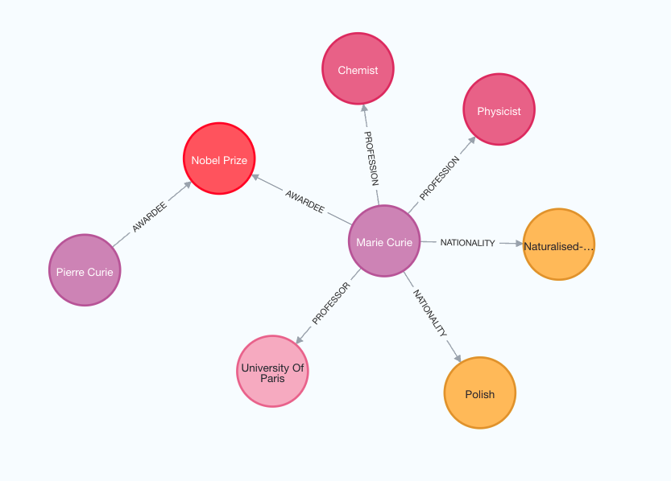

# 如何构建知识图谱

在本指南中，我们将介绍基于非结构化文本构建知识图谱的基本方法。构建的图谱可以作为RAG应用中的知识库使用。

## ⚠️ 安全提示 ⚠️

构建知识图谱需要对数据库执行写入访问。这存在固有的风险。在导入数据之前，请确保验证和确认数据的准确性。有关一般安全最佳实践的更多信息，请[查看这里](/docs/security)。


## 架构

从文本构建知识图谱的高层步骤如下：

1. **从文本中提取结构化信息**：模型用于从文本中提取结构化图信息。
2. **存储到图数据库**：将提取的结构化图信息存储到图数据库中，以支持下游RAG应用。

## 设置

首先，获取所需的包并设置环境变量。
在这个例子中，我们将使用Neo4j图形数据库。


```python
%pip install --upgrade --quiet  langchain langchain-community langchain-openai langchain-experimental neo4j
```
```output
Note: you may need to restart the kernel to use updated packages.
```
在本指南中，我们默认使用OpenAI模型。


```python
import getpass
import os

os.environ["OPENAI_API_KEY"] = getpass.getpass()

# Uncomment the below to use LangSmith. Not required.
# os.environ["LANGCHAIN_API_KEY"] = getpass.getpass()
# os.environ["LANGCHAIN_TRACING_V2"] = "true"
```
```output
 ········
```
接下来，我们需要定义Neo4j凭据和连接。
请按照[这些安装步骤](https://neo4j.com/docs/operations-manual/current/installation/)设置Neo4j数据库。


```python
<!--IMPORTS:[{"imported": "Neo4jGraph", "source": "langchain_community.graphs", "docs": "https://python.langchain.com/api_reference/community/graphs/langchain_community.graphs.neo4j_graph.Neo4jGraph.html", "title": "How to construct knowledge graphs"}]-->
import os

from langchain_community.graphs import Neo4jGraph

os.environ["NEO4J_URI"] = "bolt://localhost:7687"
os.environ["NEO4J_USERNAME"] = "neo4j"
os.environ["NEO4J_PASSWORD"] = "password"

graph = Neo4jGraph()
```

## LLM图形转换器

从文本中提取图形数据可以将非结构化信息转化为结构化格式，从而促进更深入的洞察和更高效地导航复杂的关系和模式。`LLMGraphTransformer`通过利用大型语言模型（LLM）解析和分类实体及其关系，将文本文档转换为结构化图形文档。LLM模型的选择显著影响输出，因为它决定了提取的图形数据的准确性和细微差别。


```python
<!--IMPORTS:[{"imported": "LLMGraphTransformer", "source": "langchain_experimental.graph_transformers", "docs": "https://python.langchain.com/api_reference/experimental/graph_transformers/langchain_experimental.graph_transformers.llm.LLMGraphTransformer.html", "title": "How to construct knowledge graphs"}, {"imported": "ChatOpenAI", "source": "langchain_openai", "docs": "https://python.langchain.com/api_reference/openai/chat_models/langchain_openai.chat_models.base.ChatOpenAI.html", "title": "How to construct knowledge graphs"}]-->
import os

from langchain_experimental.graph_transformers import LLMGraphTransformer
from langchain_openai import ChatOpenAI

llm = ChatOpenAI(temperature=0, model_name="gpt-4-turbo")

llm_transformer = LLMGraphTransformer(llm=llm)
```

现在我们可以传入示例文本并检查结果。


```python
<!--IMPORTS:[{"imported": "Document", "source": "langchain_core.documents", "docs": "https://python.langchain.com/api_reference/core/documents/langchain_core.documents.base.Document.html", "title": "How to construct knowledge graphs"}]-->
from langchain_core.documents import Document

text = """
Marie Curie, born in 1867, was a Polish and naturalised-French physicist and chemist who conducted pioneering research on radioactivity.
She was the first woman to win a Nobel Prize, the first person to win a Nobel Prize twice, and the only person to win a Nobel Prize in two scientific fields.
Her husband, Pierre Curie, was a co-winner of her first Nobel Prize, making them the first-ever married couple to win the Nobel Prize and launching the Curie family legacy of five Nobel Prizes.
She was, in 1906, the first woman to become a professor at the University of Paris.
"""
documents = [Document(page_content=text)]
graph_documents = llm_transformer.convert_to_graph_documents(documents)
print(f"Nodes:{graph_documents[0].nodes}")
print(f"Relationships:{graph_documents[0].relationships}")
```
```output
Nodes:[Node(id='Marie Curie', type='Person'), Node(id='Pierre Curie', type='Person'), Node(id='University Of Paris', type='Organization')]
Relationships:[Relationship(source=Node(id='Marie Curie', type='Person'), target=Node(id='Pierre Curie', type='Person'), type='MARRIED'), Relationship(source=Node(id='Marie Curie', type='Person'), target=Node(id='University Of Paris', type='Organization'), type='PROFESSOR')]
```
查看以下图像以更好地理解生成的知识图谱的结构。



请注意，图形构建过程是非确定性的，因为我们使用的是大型语言模型（LLM）。因此，您可能在每次执行时获得略有不同的结果。

此外，您可以根据需求灵活定义特定类型的节点和关系进行提取。


```python
llm_transformer_filtered = LLMGraphTransformer(
    llm=llm,
    allowed_nodes=["Person", "Country", "Organization"],
    allowed_relationships=["NATIONALITY", "LOCATED_IN", "WORKED_AT", "SPOUSE"],
)
graph_documents_filtered = llm_transformer_filtered.convert_to_graph_documents(
    documents
)
print(f"Nodes:{graph_documents_filtered[0].nodes}")
print(f"Relationships:{graph_documents_filtered[0].relationships}")
```
```output
Nodes:[Node(id='Marie Curie', type='Person'), Node(id='Pierre Curie', type='Person'), Node(id='University Of Paris', type='Organization')]
Relationships:[Relationship(source=Node(id='Marie Curie', type='Person'), target=Node(id='Pierre Curie', type='Person'), type='SPOUSE'), Relationship(source=Node(id='Marie Curie', type='Person'), target=Node(id='University Of Paris', type='Organization'), type='WORKED_AT')]
```
为了更好地理解生成的图形，我们可以再次对其进行可视化。


`node_properties` 参数使得可以提取节点属性，从而创建更详细的图形。
当设置为 `True` 时，LLM 会自主识别并提取相关的节点属性。
相反，如果 `node_properties` 被定义为字符串列表，LLM 将仅从文本中选择性地检索指定的属性。


```python
llm_transformer_props = LLMGraphTransformer(
    llm=llm,
    allowed_nodes=["Person", "Country", "Organization"],
    allowed_relationships=["NATIONALITY", "LOCATED_IN", "WORKED_AT", "SPOUSE"],
    node_properties=["born_year"],
)
graph_documents_props = llm_transformer_props.convert_to_graph_documents(documents)
print(f"Nodes:{graph_documents_props[0].nodes}")
print(f"Relationships:{graph_documents_props[0].relationships}")
```
```output
Nodes:[Node(id='Marie Curie', type='Person', properties={'born_year': '1867'}), Node(id='Pierre Curie', type='Person'), Node(id='University Of Paris', type='Organization')]
Relationships:[Relationship(source=Node(id='Marie Curie', type='Person'), target=Node(id='Pierre Curie', type='Person'), type='SPOUSE'), Relationship(source=Node(id='Marie Curie', type='Person'), target=Node(id='University Of Paris', type='Organization'), type='WORKED_AT')]
```
## 存储到图数据库

生成的图形文档可以使用 `add_graph_documents` 方法存储到图数据库中。


```python
graph.add_graph_documents(graph_documents_props)
```
