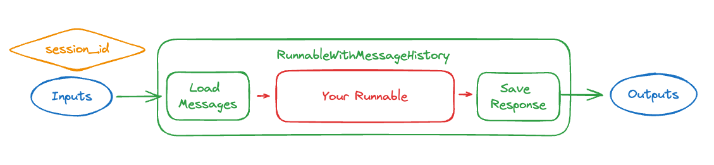

# 如何添加消息历史

:::info Prerequisites

本指南假设您熟悉以下概念：
- [LangChain表达式 (LCEL)](/docs/concepts/#langchain-expression-language)
- [链式运行](/docs/how_to/sequence/)
- [在运行时配置链参数](/docs/how_to/configure)
- [提示词模板](/docs/concepts/#prompt-templates)
- [聊天消息](/docs/concepts/#message-types)

:::

在构建聊天机器人时，将对话状态传入和传出链是至关重要的。[`RunnableWithMessageHistory`](https://python.langchain.com/api_reference/core/runnables/langchain_core.runnables.history.RunnableWithMessageHistory.html#langchain_core.runnables.history.RunnableWithMessageHistory) 类允许我们为某些类型的链添加消息历史。它包装另一个可运行对象，并管理其聊天消息历史。具体来说，它在将之前的消息传递给可运行对象之前加载对话中的先前消息，并在调用可运行对象后将生成的响应保存为消息。该类还通过使用 `session_id` 保存每个对话来支持多个对话 - 然后在调用可运行对象时期望在配置中传递 `session_id`，并使用它查找相关的对话历史。



在实践中，这看起来像：

```python
<!--IMPORTS:[{"imported": "RunnableWithMessageHistory", "source": "langchain_core.runnables.history", "docs": "https://python.langchain.com/api_reference/core/runnables/langchain_core.runnables.history.RunnableWithMessageHistory.html", "title": "How to add message history"}]-->
from langchain_core.runnables.history import RunnableWithMessageHistory


with_message_history = RunnableWithMessageHistory(
    # The underlying runnable
    runnable,  
    # A function that takes in a session id and returns a memory object
    get_session_history,  
    # Other parameters that may be needed to align the inputs/outputs
    # of the Runnable with the memory object
    ...  
)

with_message_history.invoke(
    # The same input as before
    {"ability": "math", "input": "What does cosine mean?"},
    # Configuration specifying the `session_id`,
    # which controls which conversation to load
    config={"configurable": {"session_id": "abc123"}},
)
```


为了正确设置这一点，有两个主要事项需要考虑：

1. 如何存储和加载消息？（这在上面的示例中是 `get_session_history`）
2. 你正在包装的底层 Runnable 是什么，它的输入/输出是什么？（这在上面的示例中是 `runnable`，以及你传递给 `RunnableWithMessageHistory` 的任何其他参数，以对齐输入/输出）

让我们下面逐步了解这些内容（以及更多）。

## 如何存储和加载消息

这其中一个关键部分是存储和加载消息。
在构造 `RunnableWithMessageHistory` 时，你需要传入一个 `get_session_history` 函数。
该函数应接受一个 `session_id` 并返回一个 `BaseChatMessageHistory` 对象。

**什么是 `session_id`？**

`session_id` 是与这些输入消息对应的会话（对话）线程的标识符。这使你能够同时与同一链维护多个对话/线程。

**什么是 `BaseChatMessageHistory`？**

`BaseChatMessageHistory` 是一个可以加载和保存消息对象的类。它将被 `RunnableWithMessageHistory` 调用以实现这一功能。这些类通常使用会话 ID 初始化。

让我们创建一个 `get_session_history` 对象来用于这个示例。为了简单起见，我们将使用一个简单的 SQLiteMessage。


```python
! rm memory.db
```


```python
<!--IMPORTS:[{"imported": "SQLChatMessageHistory", "source": "langchain_community.chat_message_histories", "docs": "https://python.langchain.com/api_reference/community/chat_message_histories/langchain_community.chat_message_histories.sql.SQLChatMessageHistory.html", "title": "How to add message history"}]-->
from langchain_community.chat_message_histories import SQLChatMessageHistory


def get_session_history(session_id):
    return SQLChatMessageHistory(session_id, "sqlite:///memory.db")
```

请查看 [内存集成](https://integrations.langchain.com/memory) 页面，了解使用其他大模型供应商（Redis、Postgres 等）实现的聊天消息历史。

## 你想要包装的可运行对象是什么？

`RunnableWithMessageHistory` 只能包装某些类型的可运行对象。具体来说，它可以用于任何输入为以下之一的可运行对象：

* 一系列 [`BaseMessages`](/docs/concepts/#message-types)
* 一个字典，键为一系列 `BaseMessages`
* 一个字典，键为最新的消息（作为字符串或 `BaseMessages` 的序列），另一个键为历史消息

并返回作为输出之一

* 可以被视为 `AIMessage` 内容的字符串
* 一系列 `BaseMessage`
* 一个字典，键包含一系列 `BaseMessage`

让我们看一些示例来了解它是如何工作的。

### 设置

首先我们构建一个可运行的对象（这里接受一个字典作为输入并返回一个消息作为输出）：

import ChatModelTabs from "@theme/ChatModelTabs";

<ChatModelTabs
  customVarName="llm"
/>


```python
<!--IMPORTS:[{"imported": "HumanMessage", "source": "langchain_core.messages", "docs": "https://python.langchain.com/api_reference/core/messages/langchain_core.messages.human.HumanMessage.html", "title": "How to add message history"}, {"imported": "RunnableWithMessageHistory", "source": "langchain_core.runnables.history", "docs": "https://python.langchain.com/api_reference/core/runnables/langchain_core.runnables.history.RunnableWithMessageHistory.html", "title": "How to add message history"}]-->
from langchain_core.messages import HumanMessage
from langchain_core.runnables.history import RunnableWithMessageHistory
```

### 消息输入，消息输出

最简单的形式就是给 ChatModel 添加内存。
聊天模型接受一系列消息作为输入并输出一条消息。
这使得使用 `RunnableWithMessageHistory` 变得非常简单 - 不需要额外的配置！


```python
runnable_with_history = RunnableWithMessageHistory(
    model,
    get_session_history,
)
```


```python
runnable_with_history.invoke(
    [HumanMessage(content="hi - im bob!")],
    config={"configurable": {"session_id": "1"}},
)
```


```output
AIMessage(content="It's nice to meet you, Bob! I'm Claude, an AI assistant created by Anthropic. How can I help you today?", response_metadata={'id': 'msg_01UHCCMiZz9yNYjt41xUJrtk', 'model': 'claude-3-haiku-20240307', 'stop_reason': 'end_turn', 'stop_sequence': None, 'usage': {'input_tokens': 12, 'output_tokens': 32}}, id='run-55f6a451-606b-4e04-9e39-e03b81035c1f-0', usage_metadata={'input_tokens': 12, 'output_tokens': 32, 'total_tokens': 44})
```


```python
runnable_with_history.invoke(
    [HumanMessage(content="whats my name?")],
    config={"configurable": {"session_id": "1"}},
)
```


```output
AIMessage(content='I\'m afraid I don\'t actually know your name - you introduced yourself as Bob, but I don\'t have any other information about your identity. As an AI assistant, I don\'t have a way to independently verify people\'s names or identities. I\'m happy to continue our conversation, but I\'ll just refer to you as "Bob" since that\'s the name you provided.', response_metadata={'id': 'msg_018L96tAxiexMKsHBQz22CcE', 'model': 'claude-3-haiku-20240307', 'stop_reason': 'end_turn', 'stop_sequence': None, 'usage': {'input_tokens': 52, 'output_tokens': 80}}, id='run-7399ddb5-bb06-444b-bfb2-2f65674105dd-0', usage_metadata={'input_tokens': 52, 'output_tokens': 80, 'total_tokens': 132})
```


:::info

请注意，在这种情况下，上下文通过提供的 `session_id` 的聊天历史得以保留，因此模型知道用户的名字。

:::

我们现在可以尝试使用一个新的会话 ID，看看它是否不记得。


```python
runnable_with_history.invoke(
    [HumanMessage(content="whats my name?")],
    config={"configurable": {"session_id": "1a"}},
)
```


```output
AIMessage(content="I'm afraid I don't actually know your name. As an AI assistant, I don't have personal information about you unless you provide it to me directly.", response_metadata={'id': 'msg_01LhbWu7mSKTvKAx7iQpMPzd', 'model': 'claude-3-haiku-20240307', 'stop_reason': 'end_turn', 'stop_sequence': None, 'usage': {'input_tokens': 12, 'output_tokens': 35}}, id='run-cf86cad2-21f2-4525-afc8-09bfd1e8af70-0', usage_metadata={'input_tokens': 12, 'output_tokens': 35, 'total_tokens': 47})
```


:::info      

当我们传递一个不同的 `session_id` 时，我们开始一个新的聊天历史，因此模型不知道用户的名字是什么。

:::

### 字典输入，消息输出

除了简单地包装一个原始模型，下一步是包装一个提示 + 大型语言模型。这现在将输入更改为 **字典**（因为提示的输入是一个字典）。这增加了两个复杂性。

首先：一个字典可以有多个键，但我们只想保存一个作为输入。为了做到这一点，我们现在需要指定一个键来保存为输入。

第二：一旦我们加载了消息，我们需要知道如何将它们保存到字典中。这相当于知道在字典中保存它们的哪个键。因此，我们需要指定一个键来保存加载的消息。

将所有内容放在一起，最终看起来像：


```python
<!--IMPORTS:[{"imported": "ChatPromptTemplate", "source": "langchain_core.prompts", "docs": "https://python.langchain.com/api_reference/core/prompts/langchain_core.prompts.chat.ChatPromptTemplate.html", "title": "How to add message history"}, {"imported": "MessagesPlaceholder", "source": "langchain_core.prompts", "docs": "https://python.langchain.com/api_reference/core/prompts/langchain_core.prompts.chat.MessagesPlaceholder.html", "title": "How to add message history"}]-->
from langchain_core.prompts import ChatPromptTemplate, MessagesPlaceholder

prompt = ChatPromptTemplate.from_messages(
    [
        (
            "system",
            "You're an assistant who speaks in {language}. Respond in 20 words or fewer",
        ),
        MessagesPlaceholder(variable_name="history"),
        ("human", "{input}"),
    ]
)

runnable = prompt | model

runnable_with_history = RunnableWithMessageHistory(
    runnable,
    get_session_history,
    input_messages_key="input",
    history_messages_key="history",
)
```

:::info

请注意，我们已指定 `input_messages_key`（将被视为最新输入消息的键）和 `history_messages_key`（用于添加历史消息的键）。

:::


```python
runnable_with_history.invoke(
    {"language": "italian", "input": "hi im bob!"},
    config={"configurable": {"session_id": "2"}},
)
```


```output
AIMessage(content='Ciao Bob! È un piacere conoscerti. Come stai oggi?', response_metadata={'id': 'msg_0121ADUEe4G1hMC6zbqFWofr', 'model': 'claude-3-haiku-20240307', 'stop_reason': 'end_turn', 'stop_sequence': None, 'usage': {'input_tokens': 29, 'output_tokens': 23}}, id='run-246a70df-aad6-43d6-a7e8-166d96e0d67e-0', usage_metadata={'input_tokens': 29, 'output_tokens': 23, 'total_tokens': 52})
```


```python
runnable_with_history.invoke(
    {"language": "italian", "input": "whats my name?"},
    config={"configurable": {"session_id": "2"}},
)
```


```output
AIMessage(content='Bob, il tuo nome è Bob.', response_metadata={'id': 'msg_01EDUZG6nRLGeti9KhFN5cek', 'model': 'claude-3-haiku-20240307', 'stop_reason': 'end_turn', 'stop_sequence': None, 'usage': {'input_tokens': 60, 'output_tokens': 12}}, id='run-294b4a72-81bc-4c43-b199-3aafdff87cb3-0', usage_metadata={'input_tokens': 60, 'output_tokens': 12, 'total_tokens': 72})
```


:::info

请注意，在这种情况下，上下文通过提供的 `session_id` 的聊天历史得以保留，因此模型知道用户的名字。

:::

我们现在可以尝试使用一个新的会话 ID，看看它是否不记得。


```python
runnable_with_history.invoke(
    {"language": "italian", "input": "whats my name?"},
    config={"configurable": {"session_id": "2a"}},
)
```


```output
AIMessage(content='Mi dispiace, non so il tuo nome. Come posso aiutarti?', response_metadata={'id': 'msg_01Lyd9FAGQJTxxAZoFi3sQpQ', 'model': 'claude-3-haiku-20240307', 'stop_reason': 'end_turn', 'stop_sequence': None, 'usage': {'input_tokens': 30, 'output_tokens': 23}}, id='run-19a82197-3b1c-4b5f-a68d-f91f4a2ba523-0', usage_metadata={'input_tokens': 30, 'output_tokens': 23, 'total_tokens': 53})
```


:::info      

当我们传递一个不同的 `session_id` 时，我们开始一个新的聊天历史，因此模型不知道用户的名字。

:::

### 消息输入，字典输出

当您使用模型生成字典中的一个键时，这种格式非常有用。


```python
<!--IMPORTS:[{"imported": "HumanMessage", "source": "langchain_core.messages", "docs": "https://python.langchain.com/api_reference/core/messages/langchain_core.messages.human.HumanMessage.html", "title": "How to add message history"}, {"imported": "RunnableParallel", "source": "langchain_core.runnables", "docs": "https://python.langchain.com/api_reference/core/runnables/langchain_core.runnables.base.RunnableParallel.html", "title": "How to add message history"}]-->
from langchain_core.messages import HumanMessage
from langchain_core.runnables import RunnableParallel

chain = RunnableParallel({"output_message": model})


runnable_with_history = RunnableWithMessageHistory(
    chain,
    get_session_history,
    output_messages_key="output_message",
)
```

:::info

请注意，我们已指定 `output_messages_key`（将被视为要保存的输出的键）。

:::


```python
runnable_with_history.invoke(
    [HumanMessage(content="hi - im bob!")],
    config={"configurable": {"session_id": "3"}},
)
```


```output
{'output_message': AIMessage(content="It's nice to meet you, Bob! I'm Claude, an AI assistant created by Anthropic. How can I help you today?", response_metadata={'id': 'msg_01WWJSyUyGGKuBqTs3h18ZMM', 'model': 'claude-3-haiku-20240307', 'stop_reason': 'end_turn', 'stop_sequence': None, 'usage': {'input_tokens': 12, 'output_tokens': 32}}, id='run-0f50cb43-a734-447c-b535-07c615a0984c-0', usage_metadata={'input_tokens': 12, 'output_tokens': 32, 'total_tokens': 44})}
```


```python
runnable_with_history.invoke(
    [HumanMessage(content="whats my name?")],
    config={"configurable": {"session_id": "3"}},
)
```


```output
{'output_message': AIMessage(content='I\'m afraid I don\'t actually know your name - you introduced yourself as Bob, but I don\'t have any other information about your identity. As an AI assistant, I don\'t have a way to independently verify people\'s names or identities. I\'m happy to continue our conversation, but I\'ll just refer to you as "Bob" since that\'s the name you provided.', response_metadata={'id': 'msg_01TEGrhfLXTwo36rC7svdTy4', 'model': 'claude-3-haiku-20240307', 'stop_reason': 'end_turn', 'stop_sequence': None, 'usage': {'input_tokens': 52, 'output_tokens': 80}}, id='run-178e8f3f-da21-430d-9edc-ef07797a5e2d-0', usage_metadata={'input_tokens': 52, 'output_tokens': 80, 'total_tokens': 132})}
```


:::info

请注意，在这种情况下，上下文通过提供的 `session_id` 的聊天历史得以保留，因此模型知道用户的名字。

:::

我们现在可以尝试使用一个新的会话 ID，看看它是否不记得。


```python
runnable_with_history.invoke(
    [HumanMessage(content="whats my name?")],
    config={"configurable": {"session_id": "3a"}},
)
```


```output
{'output_message': AIMessage(content="I'm afraid I don't actually know your name. As an AI assistant, I don't have personal information about you unless you provide it to me directly.", response_metadata={'id': 'msg_0118ZBudDXAC9P6smf91NhCX', 'model': 'claude-3-haiku-20240307', 'stop_reason': 'end_turn', 'stop_sequence': None, 'usage': {'input_tokens': 12, 'output_tokens': 35}}, id='run-deb14a3a-0336-42b4-8ace-ad1e52ca5910-0', usage_metadata={'input_tokens': 12, 'output_tokens': 35, 'total_tokens': 47})}
```


:::info      

当我们传递一个不同的 `session_id` 时，我们开始一个新的聊天历史，因此模型不知道用户的名字。

:::

### 单键字典用于所有消息输入和消息输出

这是“字典输入，消息输出”的特定情况。在这种情况下，由于只有一个单键，我们不需要指定太多 - 我们只需要指定 `input_messages_key`。


```python
from operator import itemgetter

runnable_with_history = RunnableWithMessageHistory(
    itemgetter("input_messages") | model,
    get_session_history,
    input_messages_key="input_messages",
)
```

:::info

请注意，我们已经指定了 `input_messages_key`（被视为最新输入消息的键）。

:::


```python
runnable_with_history.invoke(
    {"input_messages": [HumanMessage(content="hi - im bob!")]},
    config={"configurable": {"session_id": "4"}},
)
```


```output
AIMessage(content="It's nice to meet you, Bob! I'm Claude, an AI assistant created by Anthropic. How can I help you today?", response_metadata={'id': 'msg_01UdD5wz1J5xwoz5D94onaQC', 'model': 'claude-3-haiku-20240307', 'stop_reason': 'end_turn', 'stop_sequence': None, 'usage': {'input_tokens': 12, 'output_tokens': 32}}, id='run-91bee6eb-0814-4557-ad71-fef9b0270358-0', usage_metadata={'input_tokens': 12, 'output_tokens': 32, 'total_tokens': 44})
```


```python
runnable_with_history.invoke(
    {"input_messages": [HumanMessage(content="whats my name?")]},
    config={"configurable": {"session_id": "4"}},
)
```


```output
AIMessage(content='I\'m afraid I don\'t actually know your name - you introduced yourself as Bob, but I don\'t have any other information about your identity. As an AI assistant, I don\'t have a way to independently verify people\'s names or identities. I\'m happy to continue our conversation, but I\'ll just refer to you as "Bob" since that\'s the name you provided.', response_metadata={'id': 'msg_012WUygxBKXcVJPeTW14LNrc', 'model': 'claude-3-haiku-20240307', 'stop_reason': 'end_turn', 'stop_sequence': None, 'usage': {'input_tokens': 52, 'output_tokens': 80}}, id='run-fcbaaa1a-8c33-4eec-b0b0-5b800a47bddd-0', usage_metadata={'input_tokens': 52, 'output_tokens': 80, 'total_tokens': 132})
```


:::info

请注意，在这种情况下，上下文通过提供的 `session_id` 的聊天历史得以保留，因此模型知道用户的名字。

:::

我们现在可以尝试使用新的会话 ID，看看它是否不记得。


```python
runnable_with_history.invoke(
    {"input_messages": [HumanMessage(content="whats my name?")]},
    config={"configurable": {"session_id": "4a"}},
)
```


```output
AIMessage(content="I'm afraid I don't actually know your name. As an AI assistant, I don't have personal information about you unless you provide it to me directly.", response_metadata={'id': 'msg_017xW3Ki5y4UBYzCU9Mf1pgM', 'model': 'claude-3-haiku-20240307', 'stop_reason': 'end_turn', 'stop_sequence': None, 'usage': {'input_tokens': 12, 'output_tokens': 35}}, id='run-d2f372f7-3679-4a5c-9331-a55b820ec03e-0', usage_metadata={'input_tokens': 12, 'output_tokens': 35, 'total_tokens': 47})
```


:::info      

当我们传递不同的 `session_id` 时，我们开始一个新的聊天历史，因此模型不知道用户的名字是什么。

:::

## 自定义

我们通过传递一组 ``ConfigurableFieldSpec`` 对象到 ``history_factory_config`` 参数来定制跟踪消息历史的配置参数。下面，我们使用两个参数：`user_id` 和 `conversation_id`。


```python
<!--IMPORTS:[{"imported": "ConfigurableFieldSpec", "source": "langchain_core.runnables", "docs": "https://python.langchain.com/api_reference/core/runnables/langchain_core.runnables.utils.ConfigurableFieldSpec.html", "title": "How to add message history"}]-->
from langchain_core.runnables import ConfigurableFieldSpec


def get_session_history(user_id: str, conversation_id: str):
    return SQLChatMessageHistory(f"{user_id}--{conversation_id}", "sqlite:///memory.db")


with_message_history = RunnableWithMessageHistory(
    runnable,
    get_session_history,
    input_messages_key="input",
    history_messages_key="history",
    history_factory_config=[
        ConfigurableFieldSpec(
            id="user_id",
            annotation=str,
            name="User ID",
            description="Unique identifier for the user.",
            default="",
            is_shared=True,
        ),
        ConfigurableFieldSpec(
            id="conversation_id",
            annotation=str,
            name="Conversation ID",
            description="Unique identifier for the conversation.",
            default="",
            is_shared=True,
        ),
    ],
)

with_message_history.invoke(
    {"language": "italian", "input": "hi im bob!"},
    config={"configurable": {"user_id": "123", "conversation_id": "1"}},
)
```


```output
AIMessage(content='Ciao Bob! È un piacere conoscerti. Come stai oggi?', response_metadata={'id': 'msg_016RJebCoiAgWaNcbv9wrMNW', 'model': 'claude-3-haiku-20240307', 'stop_reason': 'end_turn', 'stop_sequence': None, 'usage': {'input_tokens': 29, 'output_tokens': 23}}, id='run-40425414-8f72-47d4-bf1d-a84175d8b3f8-0', usage_metadata={'input_tokens': 29, 'output_tokens': 23, 'total_tokens': 52})
```


```python
# remembers
with_message_history.invoke(
    {"language": "italian", "input": "whats my name?"},
    config={"configurable": {"user_id": "123", "conversation_id": "1"}},
)
```


```output
AIMessage(content='Bob, il tuo nome è Bob.', response_metadata={'id': 'msg_01Kktiy3auFDKESY54KtTWPX', 'model': 'claude-3-haiku-20240307', 'stop_reason': 'end_turn', 'stop_sequence': None, 'usage': {'input_tokens': 60, 'output_tokens': 12}}, id='run-c7768420-3f30-43f5-8834-74b1979630dd-0', usage_metadata={'input_tokens': 60, 'output_tokens': 12, 'total_tokens': 72})
```


```python
# New user_id --> does not remember
with_message_history.invoke(
    {"language": "italian", "input": "whats my name?"},
    config={"configurable": {"user_id": "456", "conversation_id": "1"}},
)
```


```output
AIMessage(content='Mi dispiace, non so il tuo nome. Come posso aiutarti?', response_metadata={'id': 'msg_0178FpbpPNioB7kqvyHk7rjD', 'model': 'claude-3-haiku-20240307', 'stop_reason': 'end_turn', 'stop_sequence': None, 'usage': {'input_tokens': 30, 'output_tokens': 23}}, id='run-df1f1768-aab6-4aec-8bba-e33fc9e90b8d-0', usage_metadata={'input_tokens': 30, 'output_tokens': 23, 'total_tokens': 53})
```


请注意，在这种情况下，上下文为相同的 `user_id` 保留，但一旦我们更改它，新的聊天历史就开始了，即使 `conversation_id` 是相同的。
