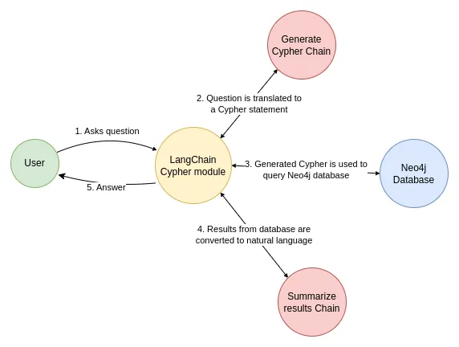

# 构建一个基于图数据库的问答应用

在本指南中，我们将介绍如何在图数据库上创建问答链的基本方法。这些系统将允许我们对图数据库中的数据提出问题，并返回自然语言答案。

## ⚠️ 安全提示 ⚠️

构建图数据库的问答系统需要执行模型生成的图查询。这会带来固有的风险。确保您的数据库连接权限始终根据链/代理的需求尽可能狭窄。这将减轻但不会消除构建模型驱动系统的风险。有关一般安全最佳实践的更多信息，请[查看这里](/docs/security)。


## 架构

从高层次来看，大多数图链的步骤包括：

1. **将问题转换为图数据库查询**：模型将用户输入转换为图数据库查询（例如，Cypher）。
2. **执行图数据库查询**：执行图数据库查询。
3. **回答问题**：模型使用查询结果响应用户输入。


## 设置

首先，获取所需的包并设置环境变量。
在这个例子中，我们将使用Neo4j图形数据库。


```python
%pip install --upgrade --quiet  langchain langchain-community langchain-openai neo4j
```

在本指南中，我们默认使用OpenAI模型。


```python
import getpass
import os

os.environ["OPENAI_API_KEY"] = getpass.getpass()

# Uncomment the below to use LangSmith. Not required.
# os.environ["LANGCHAIN_API_KEY"] = getpass.getpass()
# os.environ["LANGCHAIN_TRACING_V2"] = "true"
```
```output
 ········
```
接下来，我们需要定义Neo4j凭据。
按照[这些安装步骤](https://neo4j.com/docs/operations-manual/current/installation/)来设置Neo4j数据库。


```python
os.environ["NEO4J_URI"] = "bolt://localhost:7687"
os.environ["NEO4J_USERNAME"] = "neo4j"
os.environ["NEO4J_PASSWORD"] = "password"
```

下面的示例将创建与Neo4j数据库的连接，并用关于电影及其演员的示例数据填充它。


```python
<!--IMPORTS:[{"imported": "Neo4jGraph", "source": "langchain_community.graphs", "docs": "https://python.langchain.com/api_reference/community/graphs/langchain_community.graphs.neo4j_graph.Neo4jGraph.html", "title": "Build a Question Answering application over a Graph Database"}]-->
from langchain_community.graphs import Neo4jGraph

graph = Neo4jGraph()

# Import movie information

movies_query = """
LOAD CSV WITH HEADERS FROM 
'https://raw.githubusercontent.com/tomasonjo/blog-datasets/main/movies/movies_small.csv'
AS row
MERGE (m:Movie {id:row.movieId})
SET m.released = date(row.released),
    m.title = row.title,
    m.imdbRating = toFloat(row.imdbRating)
FOREACH (director in split(row.director, '|') | 
    MERGE (p:Person {name:trim(director)})
    MERGE (p)-[:DIRECTED]->(m))
FOREACH (actor in split(row.actors, '|') | 
    MERGE (p:Person {name:trim(actor)})
    MERGE (p)-[:ACTED_IN]->(m))
FOREACH (genre in split(row.genres, '|') | 
    MERGE (g:Genre {name:trim(genre)})
    MERGE (m)-[:IN_GENRE]->(g))
"""

graph.query(movies_query)
```


```output
[]
```


## 图形模式

为了让大型语言模型能够生成Cypher语句，它需要关于图形模式的信息。当你实例化一个图形对象时，它会检索关于图形模式的信息。如果你稍后对图形进行任何更改，可以运行`refresh_schema`方法来刷新模式信息。


```python
graph.refresh_schema()
print(graph.schema)
```
```output
Node properties are the following:
Movie {imdbRating: FLOAT, id: STRING, released: DATE, title: STRING},Person {name: STRING},Genre {name: STRING},Chunk {id: STRING, question: STRING, query: STRING, text: STRING, embedding: LIST}
Relationship properties are the following:

The relationships are the following:
(:Movie)-[:IN_GENRE]->(:Genre),(:Person)-[:DIRECTED]->(:Movie),(:Person)-[:ACTED_IN]->(:Movie)
```
太好了！我们有一个可以查询的图形数据库。现在让我们尝试将其连接到大型语言模型。

## 链

让我们使用一个简单的链，它接受一个问题，将其转换为Cypher查询，执行查询，并使用结果回答原始问题。




LangChain提供了一个内置的链，旨在与Neo4j配合使用：[GraphCypherQAChain](/docs/integrations/graphs/neo4j_cypher)


```python
<!--IMPORTS:[{"imported": "GraphCypherQAChain", "source": "langchain.chains", "docs": "https://python.langchain.com/api_reference/community/chains/langchain_community.chains.graph_qa.cypher.GraphCypherQAChain.html", "title": "Build a Question Answering application over a Graph Database"}, {"imported": "ChatOpenAI", "source": "langchain_openai", "docs": "https://python.langchain.com/api_reference/openai/chat_models/langchain_openai.chat_models.base.ChatOpenAI.html", "title": "Build a Question Answering application over a Graph Database"}]-->
from langchain.chains import GraphCypherQAChain
from langchain_openai import ChatOpenAI

llm = ChatOpenAI(model="gpt-3.5-turbo", temperature=0)
chain = GraphCypherQAChain.from_llm(graph=graph, llm=llm, verbose=True)
response = chain.invoke({"query": "What was the cast of the Casino?"})
response
```
```output


> Entering new GraphCypherQAChain chain...
Generated Cypher:
MATCH (:Movie {title: "Casino"})<-[:ACTED_IN]-(actor:Person)
RETURN actor.name
Full Context:
[{'actor.name': 'Joe Pesci'}, {'actor.name': 'Robert De Niro'}, {'actor.name': 'Sharon Stone'}, {'actor.name': 'James Woods'}]

> Finished chain.
```


```output
{'query': 'What was the cast of the Casino?',
 'result': 'The cast of Casino included Joe Pesci, Robert De Niro, Sharon Stone, and James Woods.'}
```


# 验证关系方向

大型语言模型在生成的Cypher语句中可能会对关系方向感到困惑。由于图形模式是预定义的，我们可以通过使用`validate_cypher`参数来验证并可选地纠正生成的Cypher语句中的关系方向。


```python
chain = GraphCypherQAChain.from_llm(
    graph=graph, llm=llm, verbose=True, validate_cypher=True
)
response = chain.invoke({"query": "What was the cast of the Casino?"})
response
```
```output


> Entering new GraphCypherQAChain chain...
Generated Cypher:
MATCH (:Movie {title: "Casino"})<-[:ACTED_IN]-(actor:Person)
RETURN actor.name
Full Context:
[{'actor.name': 'Joe Pesci'}, {'actor.name': 'Robert De Niro'}, {'actor.name': 'Sharon Stone'}, {'actor.name': 'James Woods'}]

> Finished chain.
```


```output
{'query': 'What was the cast of the Casino?',
 'result': 'The cast of Casino included Joe Pesci, Robert De Niro, Sharon Stone, and James Woods.'}
```


### 下一步

对于更复杂的查询生成，我们可能希望创建少量示例提示或添加查询检查步骤。有关此类高级技术和更多内容，请查看：

* [提示策略](/docs/how_to/graph_prompting)：高级提示工程技术。
* [映射值](/docs/how_to/graph_mapping)：将问题中的值映射到数据库的技术。
* [语义层](/docs/how_to/graph_semantic)：实现语义层的技术。
* [构建图形](/docs/how_to/graph_constructing)：构建知识图的技术。
