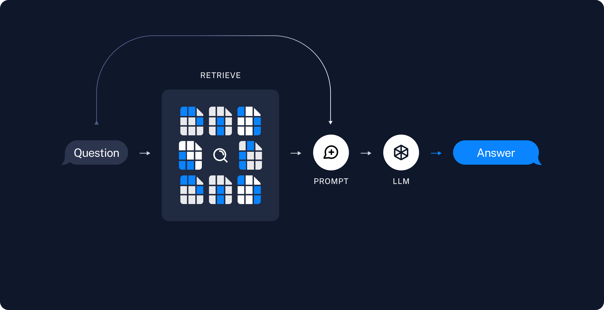

# 构建一个检索增强生成 (RAG) 应用

大型语言模型 (LLMs) 使得复杂的问答 (Q&A) 聊天机器人成为可能，这是最强大的应用之一。这些应用能够回答关于特定源信息的问题。这些应用使用一种称为检索增强生成 (RAG) 的技术。

本教程将展示如何构建一个简单的问答应用
基于文本数据源。在此过程中，我们将讨论一个典型的问答
架构，并强调更多高级问答技术的额外资源。我们还将看到
LangSmith 如何帮助我们追踪和理解我们的应用。
随着我们的应用复杂性增加，LangSmith 将变得越来越有用。
复杂性。

如果你已经熟悉基本的检索，你可能也会对
这个 [不同检索技术的高层次概述](/docs/concepts/#retrieval) 感兴趣。

## 什么是RAG？

RAG是一种通过额外数据增强大型语言模型知识的技术。

大型语言模型可以推理广泛的主题，但它们的知识仅限于训练时使用的特定时间点的公共数据。如果您想构建能够推理私有数据或在模型截止日期后引入的数据的AI应用程序，您需要用模型所需的特定信息来增强模型的知识。将适当的信息引入并插入到模型提示中的过程称为检索增强生成（RAG）。

LangChain有许多组件旨在帮助构建问答应用程序，以及更一般的RAG应用程序。

**注意**：在这里我们专注于非结构化数据的问答。如果您对结构化数据的RAG感兴趣，请查看我们关于[SQL数据的问答](/docs/tutorials/sql_qa)的教程。

## 概念
一个典型的RAG应用程序有两个主要组件：

**索引**：一个从源数据中摄取数据并进行索引的管道。*这通常在离线进行。*

**检索和生成**：实际的RAG链，在运行时接收用户查询并从索引中检索相关数据，然后将其传递给模型。

从原始数据到答案的最常见完整序列如下：

### 索引
1. **加载**: 首先我们需要加载我们的数据。这是通过 [文档加载器](/docs/concepts/#document-loaders) 完成的。
2. **分割**: [文本分割器](/docs/concepts/#text-splitters) 将大型 `文档` 分割成较小的块。这对于索引数据和将其传递给模型都很有用，因为大型块更难搜索，并且无法适应模型的有限上下文窗口。
3. **存储**: 我们需要一个地方来存储和索引我们的分割，以便后续可以进行搜索。这通常使用 [向量存储](/docs/concepts/#vector-stores) 和 [嵌入模型](/docs/concepts/#embedding-models) 来完成。


### 检索与生成
4. **检索**: 根据用户输入，从存储中使用 [检索器](/docs/concepts/#retrievers) 检索相关的分割。
5. **生成**: [聊天模型](/docs/concepts/#chat-models) / [大型语言模型](/docs/concepts/#llms) 使用包含问题和检索数据的提示生成答案。




## 设置

### Jupyter Notebook

本指南（以及文档中的大多数其他指南）使用 [Jupyter notebooks](https://jupyter.org/) 并假设读者也是如此。Jupyter notebooks 非常适合学习如何使用大型语言模型系统，因为事情有时会出错（意外输出、API故障等），在交互环境中逐步阅读指南是更好理解它们的好方法。

本教程和其他教程最方便的运行方式是使用 Jupyter notebook。有关如何安装的说明，请参见 [这里](https://jupyter.org/install)。

### 安装

本教程需要以下 LangChain 依赖项：

import Tabs from '@theme/Tabs';
import TabItem from '@theme/TabItem';
import CodeBlock from "@theme/CodeBlock";

<Tabs>
  <TabItem value="pip" label="Pip" default>
  


```python
%pip install --quiet --upgrade langchain langchain-community langchain-chroma
```

  </TabItem>
  <TabItem value="conda" label="Conda">
    <CodeBlock language="bash">conda install langchain langchain-community langchain-chroma -c conda-forge</CodeBlock>
  </TabItem>
</Tabs>


有关更多详细信息，请参阅我们的[安装指南](/docs/how_to/installation)。

### LangSmith

您使用LangChain构建的许多应用程序将包含多个步骤和多次调用大型语言模型（LLM）。
随着这些应用程序变得越来越复杂，能够检查您的链或代理内部究竟发生了什么变得至关重要。
做到这一点的最佳方法是使用[LangSmith](https://smith.langchain.com)。

在您在上述链接注册后，请确保设置您的环境变量以开始记录跟踪：

```shell
export LANGCHAIN_TRACING_V2="true"
export LANGCHAIN_API_KEY="..."
```

或者，如果在笔记本中，您可以使用以下方式设置：

```python
import getpass
import os

os.environ["LANGCHAIN_TRACING_V2"] = "true"
os.environ["LANGCHAIN_API_KEY"] = getpass.getpass()
```
## 预览

在本指南中，我们将构建一个应用程序，回答有关网站内容的问题。我们将使用的特定网站是[LLM驱动的自主
代理](https://lilianweng.github.io/posts/2023-06-23-agent/) 博客文章
由Lilian Weng撰写，允许我们询问关于
文章内容的问题。

我们可以创建一个简单的索引管道和RAG链来实现这一点，大约需要20行代码：
代码：

import ChatModelTabs from "@theme/ChatModelTabs";

<ChatModelTabs customVarName="llm" />


```python
<!--IMPORTS:[{"imported": "Chroma", "source": "langchain_chroma", "docs": "https://python.langchain.com/api_reference/chroma/vectorstores/langchain_chroma.vectorstores.Chroma.html", "title": "Build a Retrieval Augmented Generation (RAG) App"}, {"imported": "WebBaseLoader", "source": "langchain_community.document_loaders", "docs": "https://python.langchain.com/api_reference/community/document_loaders/langchain_community.document_loaders.web_base.WebBaseLoader.html", "title": "Build a Retrieval Augmented Generation (RAG) App"}, {"imported": "StrOutputParser", "source": "langchain_core.output_parsers", "docs": "https://python.langchain.com/api_reference/core/output_parsers/langchain_core.output_parsers.string.StrOutputParser.html", "title": "Build a Retrieval Augmented Generation (RAG) App"}, {"imported": "RunnablePassthrough", "source": "langchain_core.runnables", "docs": "https://python.langchain.com/api_reference/core/runnables/langchain_core.runnables.passthrough.RunnablePassthrough.html", "title": "Build a Retrieval Augmented Generation (RAG) App"}, {"imported": "OpenAIEmbeddings", "source": "langchain_openai", "docs": "https://python.langchain.com/api_reference/openai/embeddings/langchain_openai.embeddings.base.OpenAIEmbeddings.html", "title": "Build a Retrieval Augmented Generation (RAG) App"}, {"imported": "RecursiveCharacterTextSplitter", "source": "langchain_text_splitters", "docs": "https://python.langchain.com/api_reference/text_splitters/character/langchain_text_splitters.character.RecursiveCharacterTextSplitter.html", "title": "Build a Retrieval Augmented Generation (RAG) App"}]-->
import bs4
from langchain import hub
from langchain_chroma import Chroma
from langchain_community.document_loaders import WebBaseLoader
from langchain_core.output_parsers import StrOutputParser
from langchain_core.runnables import RunnablePassthrough
from langchain_openai import OpenAIEmbeddings
from langchain_text_splitters import RecursiveCharacterTextSplitter

# Load, chunk and index the contents of the blog.
loader = WebBaseLoader(
    web_paths=("https://lilianweng.github.io/posts/2023-06-23-agent/",),
    bs_kwargs=dict(
        parse_only=bs4.SoupStrainer(
            class_=("post-content", "post-title", "post-header")
        )
    ),
)
docs = loader.load()

text_splitter = RecursiveCharacterTextSplitter(chunk_size=1000, chunk_overlap=200)
splits = text_splitter.split_documents(docs)
vectorstore = Chroma.from_documents(documents=splits, embedding=OpenAIEmbeddings())

# Retrieve and generate using the relevant snippets of the blog.
retriever = vectorstore.as_retriever()
prompt = hub.pull("rlm/rag-prompt")


def format_docs(docs):
    return "\n\n".join(doc.page_content for doc in docs)


rag_chain = (
    {"context": retriever | format_docs, "question": RunnablePassthrough()}
    | prompt
    | llm
    | StrOutputParser()
)

rag_chain.invoke("What is Task Decomposition?")
```


```output
'Task Decomposition is a process where a complex task is broken down into smaller, simpler steps or subtasks. This technique is utilized to enhance model performance on complex tasks by making them more manageable. It can be done by using language models with simple prompting, task-specific instructions, or with human inputs.'
```


```python
# cleanup
vectorstore.delete_collection()
```

查看[LangSmith
跟踪](https://smith.langchain.com/public/1c6ca97e-445b-4d00-84b4-c7befcbc59fe/r)。

## 详细步骤

让我们逐步分析上述代码，以真正理解发生了什么。
正在进行中。

## 1. 索引：加载 {#indexing-load}

我们需要首先加载博客文章的内容。我们可以使用
[文档加载器](/docs/concepts#document-loaders)
来实现这一点，它们是从源加载数据并返回
列表的
[文档](https://python.langchain.com/api_reference/core/documents/langchain_core.documents.base.Document.html)。
一个 `Document` 是一个包含一些 `page_content` (str) 和 `metadata`
(dict) 的对象。

在这种情况下，我们将使用
[WebBaseLoader](/docs/integrations/document_loaders/web_base)，
使用 `urllib` 从网页 URL 加载 HTML，并使用 `BeautifulSoup` 将其
解析为文本。我们可以通过传递参数来定制 HTML -\> 文本解析
给 `BeautifulSoup` 解析器，使用 `bs_kwargs` (见
[BeautifulSoup
文档](https://beautiful-soup-4.readthedocs.io/en/latest/#beautifulsoup)).
在这种情况下，只有类为 “post-content”、“post-title” 或
“post-header” 的 HTML 标签是相关的，因此我们将移除所有其他标签。


```python
<!--IMPORTS:[{"imported": "WebBaseLoader", "source": "langchain_community.document_loaders", "docs": "https://python.langchain.com/api_reference/community/document_loaders/langchain_community.document_loaders.web_base.WebBaseLoader.html", "title": "Build a Retrieval Augmented Generation (RAG) App"}]-->
import bs4
from langchain_community.document_loaders import WebBaseLoader

# Only keep post title, headers, and content from the full HTML.
bs4_strainer = bs4.SoupStrainer(class_=("post-title", "post-header", "post-content"))
loader = WebBaseLoader(
    web_paths=("https://lilianweng.github.io/posts/2023-06-23-agent/",),
    bs_kwargs={"parse_only": bs4_strainer},
)
docs = loader.load()

len(docs[0].page_content)
```


```output
43131
```


```python
print(docs[0].page_content[:500])
```
```output


      LLM Powered Autonomous Agents
    
Date: June 23, 2023  |  Estimated Reading Time: 31 min  |  Author: Lilian Weng


Building agents with LLM (large language model) as its core controller is a cool concept. Several proof-of-concepts demos, such as AutoGPT, GPT-Engineer and BabyAGI, serve as inspiring examples. The potentiality of LLM extends beyond generating well-written copies, stories, essays and programs; it can be framed as a powerful general problem solver.
Agent System Overview#
In
```
### 深入了解

`DocumentLoader`: 从源加载数据作为 `Documents` 的列表的对象。
`文档`。

- [文档](/docs/how_to#document-loaders):
关于如何使用 `DocumentLoaders` 的详细文档。
- [集成](/docs/integrations/document_loaders/): 160+
可供选择的集成。
- [接口](https://python.langchain.com/api_reference/core/document_loaders/langchain_core.document_loaders.base.BaseLoader.html):
基础接口的 API 参考。


## 2. 索引: 分割 {#indexing-split}


我们加载的文档超过 42k 字符。这太长，无法适应
许多模型的上下文窗口。即使对于那些可以
将完整帖子放入其上下文窗口的模型，模型也可能难以找到
非常长输入中的信息。

为了解决这个问题，我们将把 `Document` 拆分成块以进行嵌入和
向量存储。这应该帮助我们在运行时仅检索最相关的部分
博客文章。

在这种情况下，我们将把文档拆分成每块1000个字符
并在块之间重叠200个字符。重叠有助于
减轻将陈述与相关重要
上下文分开的可能性。我们使用
[RecursiveCharacterTextSplitter](/docs/how_to/recursive_text_splitter)，
它将使用常见分隔符递归地拆分文档，例如
直到每个块的大小合适的新行。这是
通用文本用例的推荐文本分割器。

我们设置 `add_start_index=True`，以便每个
分割文档在初始文档中的字符索引得以保留，作为
元数据属性“start_index”。


```python
<!--IMPORTS:[{"imported": "RecursiveCharacterTextSplitter", "source": "langchain_text_splitters", "docs": "https://python.langchain.com/api_reference/text_splitters/character/langchain_text_splitters.character.RecursiveCharacterTextSplitter.html", "title": "Build a Retrieval Augmented Generation (RAG) App"}]-->
from langchain_text_splitters import RecursiveCharacterTextSplitter

text_splitter = RecursiveCharacterTextSplitter(
    chunk_size=1000, chunk_overlap=200, add_start_index=True
)
all_splits = text_splitter.split_documents(docs)

len(all_splits)
```


```output
66
```


```python
len(all_splits[0].page_content)
```


```output
969
```


```python
all_splits[10].metadata
```


```output
{'source': 'https://lilianweng.github.io/posts/2023-06-23-agent/',
 'start_index': 7056}
```


### 深入了解

`TextSplitter`：将一组 `Document` 列表分割成更小的
块的对象。`DocumentTransformer` 的子类。

- 通过阅读 [如何文档](/docs/how_to#text-splitters) 了解使用不同方法分割文本的更多信息
- [代码 (py 或 js)](/docs/integrations/document_loaders/source_code)
- [科学论文](/docs/integrations/document_loaders/grobid)
- [接口](https://python.langchain.com/api_reference/text_splitters/base/langchain_text_splitters.base.TextSplitter.html): 基础接口的API参考。

`DocumentTransformer`: 对文档对象列表进行转换的对象。
的`Document`对象。

- [文档](/docs/how_to#text-splitters): 关于如何使用`DocumentTransformers`的详细文档。
- [集成](/docs/integrations/document_transformers/)
- [接口](https://python.langchain.com/api_reference/core/documents/langchain_core.documents.transformers.BaseDocumentTransformer.html): 基础接口的API参考。

## 3. 索引: 存储 {#indexing-store}

现在我们需要对我们的66个文本块进行索引，以便在运行时可以对它们进行搜索。
最常见的方法是嵌入内容。
将每个文档分割并将这些嵌入插入向量数据库
(或向量存储)。当我们想要搜索我们的分割时，我们会取一个
文本搜索查询，将其嵌入，并执行某种“相似性”
搜索，以识别与我们查询嵌入最相似的存储分割。
最简单的相似性度量是余弦
相似性——我们测量每对
嵌入（它们是高维向量）之间的角度余弦。

我们可以在一个命令中嵌入并存储我们所有的文档分割
使用[Chroma](/docs/integrations/vectorstores/chroma)
向量存储和
[OpenAI嵌入](/docs/integrations/text_embedding/openai)
模型。


```python
<!--IMPORTS:[{"imported": "Chroma", "source": "langchain_chroma", "docs": "https://python.langchain.com/api_reference/chroma/vectorstores/langchain_chroma.vectorstores.Chroma.html", "title": "Build a Retrieval Augmented Generation (RAG) App"}, {"imported": "OpenAIEmbeddings", "source": "langchain_openai", "docs": "https://python.langchain.com/api_reference/openai/embeddings/langchain_openai.embeddings.base.OpenAIEmbeddings.html", "title": "Build a Retrieval Augmented Generation (RAG) App"}]-->
from langchain_chroma import Chroma
from langchain_openai import OpenAIEmbeddings

vectorstore = Chroma.from_documents(documents=all_splits, embedding=OpenAIEmbeddings())
```

### 深入了解

`嵌入`: 包装文本嵌入模型，用于将
文本转换为嵌入。

- [文档](/docs/how_to/embed_text): 关于如何使用嵌入的详细文档。
- [集成](/docs/integrations/text_embedding/): 30+ 种集成可供选择。
- [接口](https://python.langchain.com/api_reference/core/embeddings/langchain_core.embeddings.Embeddings.html): 基础接口的 API 参考。

`向量存储`: 包装向量数据库，用于存储和
查询嵌入。

- [文档](/docs/how_to/vectorstores): 关于如何使用向量存储的详细文档。
- [集成](/docs/integrations/vectorstores/): 40+ 种集成可供选择。
- [接口](https://python.langchain.com/api_reference/core/vectorstores/langchain_core.vectorstores.VectorStore.html): 基础接口的 API 参考。

这完成了管道的 **索引** 部分。此时
我们拥有一个可查询的向量存储，包含我们
博客文章的分块内容。给定用户问题，我们理想情况下应该能够返回
回答该问题的博客文章片段。

## 4. 检索与生成: 检索 {#retrieval-and-generation-retrieve}

现在让我们编写实际的应用逻辑。我们想要创建一个简单的
应用程序，接受用户问题，搜索相关文档。
将检索到的文档和初始问题传递给该问题，
一个模型，并返回答案。

首先，我们需要定义搜索文档的逻辑。
LangChain 定义了一个
[检索器](/docs/concepts#retrievers/) 接口
它封装了一个可以根据字符串返回相关 `文档` 的索引
查询。

最常见的 `检索器` 类型是
[向量存储检索器](/docs/how_to/vectorstore_retriever)，
它利用向量存储的相似性搜索能力来
促进检索。任何 `VectorStore` 都可以轻松转换为一个
`Retriever`，使用 `VectorStore.as_retriever()`:


```python
retriever = vectorstore.as_retriever(search_type="similarity", search_kwargs={"k": 6})

retrieved_docs = retriever.invoke("What are the approaches to Task Decomposition?")

len(retrieved_docs)
```


```output
6
```


```python
print(retrieved_docs[0].page_content)
```
```output
Tree of Thoughts (Yao et al. 2023) extends CoT by exploring multiple reasoning possibilities at each step. It first decomposes the problem into multiple thought steps and generates multiple thoughts per step, creating a tree structure. The search process can be BFS (breadth-first search) or DFS (depth-first search) with each state evaluated by a classifier (via a prompt) or majority vote.
Task decomposition can be done (1) by LLM with simple prompting like "Steps for XYZ.\n1.", "What are the subgoals for achieving XYZ?", (2) by using task-specific instructions; e.g. "Write a story outline." for writing a novel, or (3) with human inputs.
```
### 深入了解

向量存储通常用于检索，但还有其他方式
也可以进行检索。

`Retriever`：一个根据文本查询返回 `Document` 的对象

- [文档](/docs/how_to#retrievers)：进一步
关于接口和内置检索技术的文档。
其中一些包括：
- `MultiQueryRetriever` [生成输入的变体
问题](/docs/how_to/MultiQueryRetriever)
以提高检索命中率。
- `MultiVectorRetriever` 生成
[嵌入](/docs/how_to/multi_vector)，
同样是为了提高检索命中率。
- `最大边际相关性` 选择 [相关性和
多样性](https://www.cs.cmu.edu/~jgc/publication/The_Use_MMR_Diversity_Based_LTMIR_1998.pdf)
在检索到的文档中，以避免传递重复的
上下文。
上下文。
- 文档可以在向量存储检索时使用
元数据过滤器进行过滤，例如使用 [自查询
检索器](/docs/how_to/self_query)。
- [集成](/docs/integrations/retrievers/): 与检索服务的集成。
与检索服务一起使用。
- [接口](https://python.langchain.com/api_reference/core/retrievers/langchain_core.retrievers.BaseRetriever.html):
基础接口的API参考。

## 5. 检索与生成: 生成 {#retrieval-and-generation-generate}

让我们将所有内容整合到一个链中，该链接受一个问题，检索
相关文档，构建提示，将其传递给模型，并
解析输出。

我们将使用 gpt-4o-mini OpenAI 聊天模型，但可以替换为任何 LangChain `LLM`
或 `ChatModel`。

<ChatModelTabs
  customVarName="llm"
  anthropicParams={`model="claude-3-sonnet-20240229", temperature=0.2, max_tokens=1024`}
/>

我们将使用一个用于 RAG 的提示，该提示已检查到 LangChain 提示中心
（[这里](https://smith.langchain.com/hub/rlm/rag-prompt)）。


```python
from langchain import hub

prompt = hub.pull("rlm/rag-prompt")

example_messages = prompt.invoke(
    {"context": "filler context", "question": "filler question"}
).to_messages()

example_messages
```


```output
[HumanMessage(content="You are an assistant for question-answering tasks. Use the following pieces of retrieved context to answer the question. If you don't know the answer, just say that you don't know. Use three sentences maximum and keep the answer concise.\nQuestion: filler question \nContext: filler context \nAnswer:")]
```


```python
print(example_messages[0].content)
```
```output
You are an assistant for question-answering tasks. Use the following pieces of retrieved context to answer the question. If you don't know the answer, just say that you don't know. Use three sentences maximum and keep the answer concise.
Question: filler question 
Context: filler context 
Answer:
```
我们将使用 [LCEL 可运行接口](/docs/concepts#langchain-expression-language-lcel)
协议来定义链，允许我们

- 以透明的方式将组件和函数连接在一起
- 自动追踪我们在 LangSmith 中的链
- 开箱即用地获得流式、异步和批量调用。

这是实现：


```python
<!--IMPORTS:[{"imported": "StrOutputParser", "source": "langchain_core.output_parsers", "docs": "https://python.langchain.com/api_reference/core/output_parsers/langchain_core.output_parsers.string.StrOutputParser.html", "title": "Build a Retrieval Augmented Generation (RAG) App"}, {"imported": "RunnablePassthrough", "source": "langchain_core.runnables", "docs": "https://python.langchain.com/api_reference/core/runnables/langchain_core.runnables.passthrough.RunnablePassthrough.html", "title": "Build a Retrieval Augmented Generation (RAG) App"}]-->
from langchain_core.output_parsers import StrOutputParser
from langchain_core.runnables import RunnablePassthrough


def format_docs(docs):
    return "\n\n".join(doc.page_content for doc in docs)


rag_chain = (
    {"context": retriever | format_docs, "question": RunnablePassthrough()}
    | prompt
    | llm
    | StrOutputParser()
)

for chunk in rag_chain.stream("What is Task Decomposition?"):
    print(chunk, end="", flush=True)
```
```output
Task Decomposition is a process where a complex task is broken down into smaller, more manageable steps or parts. This is often done using techniques like "Chain of Thought" or "Tree of Thoughts", which instruct a model to "think step by step" and transform large tasks into multiple simple tasks. Task decomposition can be prompted in a model, guided by task-specific instructions, or influenced by human inputs.
```
让我们剖析一下 LCEL，以理解发生了什么。

首先：这些组件（`retriever`、`prompt`、`llm` 等）都是 [Runnable](/docs/concepts#langchain-expression-language-lcel) 的实例。这意味着它们实现了相同的方法——例如同步和异步的 `.invoke`、`.stream` 或 `.batch`——这使得它们更容易连接在一起。它们可以通过 `|` 操作符连接成一个 [RunnableSequence](https://python.langchain.com/api_reference/core/runnables/langchain_core.runnables.base.RunnableSequence.html)——另一个 Runnable。

LangChain 会在遇到 `|` 操作符时自动将某些对象转换为 runnable。在这里，`format_docs` 被转换为 [RunnableLambda](https://python.langchain.com/api_reference/core/runnables/langchain_core.runnables.base.RunnableLambda.html)，而包含 "context" 和 "question" 的字典被转换为 [RunnableParallel](https://python.langchain.com/api_reference/core/runnables/langchain_core.runnables.base.RunnableParallel.html)。细节不如更重要的观点重要，即每个对象都是一个 Runnable。

让我们追踪一下输入问题是如何流经上述 runnable 的。

正如我们上面所看到的，`prompt` 的输入预计是一个包含键 "context" 和 "question" 的字典。因此，这个链的第一个元素构建了将从输入问题计算这两个值的 runnables：
- `retriever | format_docs` 将问题传递给检索器，生成 [Document](https://python.langchain.com/api_reference/core/documents/langchain_core.documents.base.Document.html) 对象，然后传递给 `format_docs` 以生成字符串；
- `RunnablePassthrough()` 不改变输入问题，直接传递。

也就是说，如果你构建了
```python
chain = (
    {"context": retriever | format_docs, "question": RunnablePassthrough()}
    | prompt
)
```
那么 `chain.invoke(question)` 将构建一个格式化的提示，准备进行推理。（注意：在使用 LCEL 开发时，测试这样的子链可能是实用的。）

链的最后步骤是 `llm`，它运行推理，以及 `StrOutputParser()`，它只是从 LLM 的输出消息中提取字符串内容。

您可以通过其 [LangSmith
跟踪](https://smith.langchain.com/public/1799e8db-8a6d-4eb2-84d5-46e8d7d5a99b/r) 分析此链的各个步骤。

### 内置链

如果需要，LangChain 包含实现上述 LCEL 的便利函数。我们组合了两个函数：

- [create_stuff_documents_chain](https://python.langchain.com/api_reference/langchain/chains/langchain.chains.combine_documents.stuff.create_stuff_documents_chain.html) 指定如何将检索到的上下文输入到提示和 LLM 中。在这种情况下，我们将“填充”内容到提示中——即，我们将包括所有检索到的上下文，而不进行任何总结或其他处理。它在很大程度上实现了我们上述的 `rag_chain`，输入键为 `context` 和 `input`——它使用检索到的上下文和查询生成答案。
- [create_retrieval_chain](https://python.langchain.com/api_reference/langchain/chains/langchain.chains.retrieval.create_retrieval_chain.html) 添加了检索步骤，并通过链传播检索到的上下文，提供最终答案。它的输入键为 `input`，并在其输出中包括 `input`、`context` 和 `answer`。


```python
<!--IMPORTS:[{"imported": "create_retrieval_chain", "source": "langchain.chains", "docs": "https://python.langchain.com/api_reference/langchain/chains/langchain.chains.retrieval.create_retrieval_chain.html", "title": "Build a Retrieval Augmented Generation (RAG) App"}, {"imported": "create_stuff_documents_chain", "source": "langchain.chains.combine_documents", "docs": "https://python.langchain.com/api_reference/langchain/chains/langchain.chains.combine_documents.stuff.create_stuff_documents_chain.html", "title": "Build a Retrieval Augmented Generation (RAG) App"}, {"imported": "ChatPromptTemplate", "source": "langchain_core.prompts", "docs": "https://python.langchain.com/api_reference/core/prompts/langchain_core.prompts.chat.ChatPromptTemplate.html", "title": "Build a Retrieval Augmented Generation (RAG) App"}]-->
from langchain.chains import create_retrieval_chain
from langchain.chains.combine_documents import create_stuff_documents_chain
from langchain_core.prompts import ChatPromptTemplate

system_prompt = (
    "You are an assistant for question-answering tasks. "
    "Use the following pieces of retrieved context to answer "
    "the question. If you don't know the answer, say that you "
    "don't know. Use three sentences maximum and keep the "
    "answer concise."
    "\n\n"
    "{context}"
)

prompt = ChatPromptTemplate.from_messages(
    [
        ("system", system_prompt),
        ("human", "{input}"),
    ]
)


question_answer_chain = create_stuff_documents_chain(llm, prompt)
rag_chain = create_retrieval_chain(retriever, question_answer_chain)

response = rag_chain.invoke({"input": "What is Task Decomposition?"})
print(response["answer"])
```
```output
Task Decomposition is a process in which complex tasks are broken down into smaller and simpler steps. Techniques like Chain of Thought (CoT) and Tree of Thoughts are used to enhance model performance on these tasks. The CoT method instructs the model to think step by step, decomposing hard tasks into manageable ones, while Tree of Thoughts extends CoT by exploring multiple reasoning possibilities at each step, creating a tree structure of thoughts.
```
#### 返回来源
在问答应用中，向用户展示用于生成答案的来源通常很重要。LangChain内置的`create_retrieval_chain`将通过`"context"`键将检索到的源文档传递到输出中：


```python
for document in response["context"]:
    print(document)
    print()
```
```output
page_content='Fig. 1. Overview of a LLM-powered autonomous agent system.\nComponent One: Planning#\nA complicated task usually involves many steps. An agent needs to know what they are and plan ahead.\nTask Decomposition#\nChain of thought (CoT; Wei et al. 2022) has become a standard prompting technique for enhancing model performance on complex tasks. The model is instructed to “think step by step” to utilize more test-time computation to decompose hard tasks into smaller and simpler steps. CoT transforms big tasks into multiple manageable tasks and shed lights into an interpretation of the model’s thinking process.' metadata={'source': 'https://lilianweng.github.io/posts/2023-06-23-agent/'}

page_content='Fig. 1. Overview of a LLM-powered autonomous agent system.\nComponent One: Planning#\nA complicated task usually involves many steps. An agent needs to know what they are and plan ahead.\nTask Decomposition#\nChain of thought (CoT; Wei et al. 2022) has become a standard prompting technique for enhancing model performance on complex tasks. The model is instructed to “think step by step” to utilize more test-time computation to decompose hard tasks into smaller and simpler steps. CoT transforms big tasks into multiple manageable tasks and shed lights into an interpretation of the model’s thinking process.' metadata={'source': 'https://lilianweng.github.io/posts/2023-06-23-agent/', 'start_index': 1585}

page_content='Tree of Thoughts (Yao et al. 2023) extends CoT by exploring multiple reasoning possibilities at each step. It first decomposes the problem into multiple thought steps and generates multiple thoughts per step, creating a tree structure. The search process can be BFS (breadth-first search) or DFS (depth-first search) with each state evaluated by a classifier (via a prompt) or majority vote.\nTask decomposition can be done (1) by LLM with simple prompting like "Steps for XYZ.\\n1.", "What are the subgoals for achieving XYZ?", (2) by using task-specific instructions; e.g. "Write a story outline." for writing a novel, or (3) with human inputs.' metadata={'source': 'https://lilianweng.github.io/posts/2023-06-23-agent/', 'start_index': 2192}

page_content='Tree of Thoughts (Yao et al. 2023) extends CoT by exploring multiple reasoning possibilities at each step. It first decomposes the problem into multiple thought steps and generates multiple thoughts per step, creating a tree structure. The search process can be BFS (breadth-first search) or DFS (depth-first search) with each state evaluated by a classifier (via a prompt) or majority vote.\nTask decomposition can be done (1) by LLM with simple prompting like "Steps for XYZ.\\n1.", "What are the subgoals for achieving XYZ?", (2) by using task-specific instructions; e.g. "Write a story outline." for writing a novel, or (3) with human inputs.' metadata={'source': 'https://lilianweng.github.io/posts/2023-06-23-agent/'}

page_content='Resources:\n1. Internet access for searches and information gathering.\n2. Long Term memory management.\n3. GPT-3.5 powered Agents for delegation of simple tasks.\n4. File output.\n\nPerformance Evaluation:\n1. Continuously review and analyze your actions to ensure you are performing to the best of your abilities.\n2. Constructively self-criticize your big-picture behavior constantly.\n3. Reflect on past decisions and strategies to refine your approach.\n4. Every command has a cost, so be smart and efficient. Aim to complete tasks in the least number of steps.' metadata={'source': 'https://lilianweng.github.io/posts/2023-06-23-agent/'}

page_content='Resources:\n1. Internet access for searches and information gathering.\n2. Long Term memory management.\n3. GPT-3.5 powered Agents for delegation of simple tasks.\n4. File output.\n\nPerformance Evaluation:\n1. Continuously review and analyze your actions to ensure you are performing to the best of your abilities.\n2. Constructively self-criticize your big-picture behavior constantly.\n3. Reflect on past decisions and strategies to refine your approach.\n4. Every command has a cost, so be smart and efficient. Aim to complete tasks in the least number of steps.' metadata={'source': 'https://lilianweng.github.io/posts/2023-06-23-agent/', 'start_index': 29630}
```
### 深入了解

#### 选择模型

`ChatModel`：一个基于大型语言模型的聊天模型。接收一系列消息
并返回一条消息。

- [文档](/docs/how_to#chat-models)
- [集成](/docs/integrations/chat/)：可选择25+个集成。
- [接口](https://python.langchain.com/api_reference/core/language_models/langchain_core.language_models.chat_models.BaseChatModel.html)：基础接口的API参考。

`LLM`：一个文本输入文本输出的LLM。接收一个字符串并返回一个字符串。

- [文档](/docs/how_to#llms)
- [集成](/docs/integrations/llms): 75+ 种集成可供选择。
- [接口](https://python.langchain.com/api_reference/core/language_models/langchain_core.language_models.llms.BaseLLM.html): 基础接口的 API 参考。

查看关于使用本地运行模型的 RAG 指南
[在这里](/docs/tutorials/local_rag)。

#### 自定义提示词

如上所示，我们可以从提示词中心加载提示词（例如，[这个 RAG
提示](https://smith.langchain.com/hub/rlm/rag-prompt)），
提示词也可以轻松自定义：


```python
<!--IMPORTS:[{"imported": "PromptTemplate", "source": "langchain_core.prompts", "docs": "https://python.langchain.com/api_reference/core/prompts/langchain_core.prompts.prompt.PromptTemplate.html", "title": "Build a Retrieval Augmented Generation (RAG) App"}]-->
from langchain_core.prompts import PromptTemplate

template = """Use the following pieces of context to answer the question at the end.
If you don't know the answer, just say that you don't know, don't try to make up an answer.
Use three sentences maximum and keep the answer as concise as possible.
Always say "thanks for asking!" at the end of the answer.

{context}

Question: {question}

Helpful Answer:"""
custom_rag_prompt = PromptTemplate.from_template(template)

rag_chain = (
    {"context": retriever | format_docs, "question": RunnablePassthrough()}
    | custom_rag_prompt
    | llm
    | StrOutputParser()
)

rag_chain.invoke("What is Task Decomposition?")
```


```output
'Task decomposition is the process of breaking down a complex task into smaller, more manageable parts. Techniques like Chain of Thought (CoT) and Tree of Thoughts allow an agent to "think step by step" and explore multiple reasoning possibilities, respectively. This process can be executed by a Language Model with simple prompts, task-specific instructions, or human inputs. Thanks for asking!'
```


查看 [LangSmith
追踪](https://smith.langchain.com/public/da23c4d8-3b33-47fd-84df-a3a582eedf84/r)

## 下一步

我们已经涵盖了构建基本问答应用程序的步骤：

- 使用[文档加载器](/docs/concepts#document-loaders)加载数据
- 使用[文本分割器](/docs/concepts#text-splitters)对索引数据进行分块，以便模型更容易使用
- [嵌入数据](/docs/concepts#embedding-models)并将数据存储在[向量存储](/docs/how_to/vectorstores)中
- [检索](/docs/concepts#retrievers)之前存储的块以响应传入的问题
- 使用检索到的块作为上下文生成答案

在上述每个部分中都有许多功能、集成和扩展可供探索。
除了提到的**深入了解**资源
以上，好的下一步包括：

- [返回源文档](/docs/how_to/qa_sources): 学习如何返回源文档
- [流式处理](/docs/how_to/streaming): 学习如何流式输出和中间步骤
- [添加聊天历史](/docs/how_to/message_history): 学习如何将聊天历史添加到您的应用中
- [检索概念指南](/docs/concepts/#retrieval): 特定检索技术的高级概述
- [构建本地RAG应用](/docs/tutorials/local_rag): 创建一个类似于上述应用的应用，使用所有本地组件
