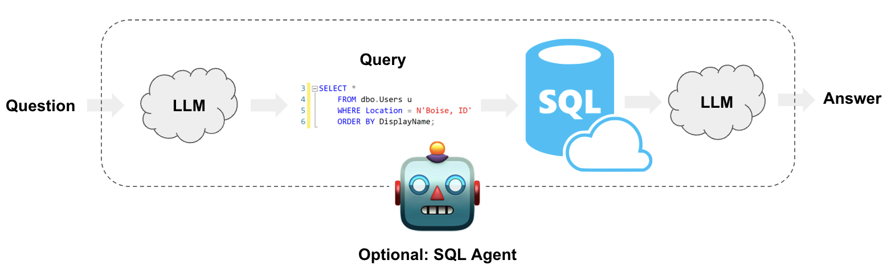

# 构建一个基于SQL数据的问答系统

:::info Prerequisites

本指南假设您熟悉以下概念：

- [链接可运行组件](/docs/how_to/sequence/)
- [聊天模型](/docs/concepts/#chat-models)
- [工具](/docs/concepts/#tools)
- [代理](/docs/concepts/#agents)

:::

使大型语言模型系统能够查询结构化数据与查询非结构化文本数据在质上是不同的。在后者中，生成可以在向量数据库中搜索的文本是常见的，而对于结构化数据，通常是让大型语言模型在领域特定语言（DSL）中编写和执行查询，例如SQL。在本指南中，我们将介绍如何在数据库的表格数据上创建问答系统的基本方法。我们将涵盖使用链和代理的实现。这些系统将允许我们对数据库中的数据提出问题，并返回自然语言答案。两者之间的主要区别在于我们的代理可以循环查询数据库多次，以满足回答问题的需要。

## ⚠️ 安全注意 ⚠️

构建SQL数据库的问答系统需要执行模型生成的SQL查询。这存在固有的风险。确保您的数据库连接权限始终根据链/代理的需求尽可能狭窄。这将减轻但不会消除构建模型驱动系统的风险。有关一般安全最佳实践的更多信息，[请参见这里](/docs/security)。


## 架构

从高层次来看，这些系统的步骤是：

1. **将问题转换为DSL查询**：模型将用户输入转换为SQL查询。
2. **执行SQL查询**：执行查询。
3. **回答问题**：模型使用查询结果响应用户输入。

请注意，查询CSV中的数据可以遵循类似的方法。有关CSV数据问答的更多细节，请参见我们的[使用指南](/docs/how_to/sql_csv)。



## 设置

首先，获取所需的包并设置环境变量：


```python
%%capture --no-stderr
%pip install --upgrade --quiet langchain langchain-community langchain-openai faiss-cpu
```

在本指南中，我们将使用一个OpenAI模型和一个[基于FAISS的向量存储](/docs/integrations/vectorstores/faiss/)。


```python
import getpass
import os

if not os.environ.get("OPENAI_API_KEY"):
    os.environ["OPENAI_API_KEY"] = getpass.getpass()

# Comment out the below to opt-out of using LangSmith in this notebook. Not required.
if not os.environ.get("LANGCHAIN_API_KEY"):
    os.environ["LANGCHAIN_API_KEY"] = getpass.getpass()
    os.environ["LANGCHAIN_TRACING_V2"] = "true"
```

下面的示例将使用与Chinook数据库的SQLite连接。请按照[这些安装步骤](https://database.guide/2-sample-databases-sqlite/)在与此笔记本相同的目录中创建`Chinook.db`：

* 将[此文件](https://raw.githubusercontent.com/lerocha/chinook-database/master/ChinookDatabase/DataSources/Chinook_Sqlite.sql)保存为`Chinook.sql`
* 运行`sqlite3 Chinook.db`
* 运行`.read Chinook.sql`
* 测试`SELECT * FROM Artist LIMIT 10;`

现在，`Chinhook.db`在我们的目录中，我们可以使用SQLAlchemy驱动的`SQLDatabase`类与之接口：


```python
<!--IMPORTS:[{"imported": "SQLDatabase", "source": "langchain_community.utilities", "docs": "https://python.langchain.com/api_reference/community/utilities/langchain_community.utilities.sql_database.SQLDatabase.html", "title": "Build a Question/Answering system over SQL data"}]-->
from langchain_community.utilities import SQLDatabase

db = SQLDatabase.from_uri("sqlite:///Chinook.db")
print(db.dialect)
print(db.get_usable_table_names())
db.run("SELECT * FROM Artist LIMIT 10;")
```
```output
sqlite
['Album', 'Artist', 'Customer', 'Employee', 'Genre', 'Invoice', 'InvoiceLine', 'MediaType', 'Playlist', 'PlaylistTrack', 'Track']
```


```output
"[(1, 'AC/DC'), (2, 'Accept'), (3, 'Aerosmith'), (4, 'Alanis Morissette'), (5, 'Alice In Chains'), (6, 'Antônio Carlos Jobim'), (7, 'Apocalyptica'), (8, 'Audioslave'), (9, 'BackBeat'), (10, 'Billy Cobham')]"
```


太好了！我们有一个可以查询的SQL数据库。现在让我们尝试将其连接到一个大型语言模型（LLM）。

## 链 {#chains}

链（即LangChain [可运行组件](/docs/concepts#langchain-expression-language-lcel)的组合）支持步骤可预测的应用程序。我们可以创建一个简单的链，它接受一个问题并执行以下操作：
- 将问题转换为 SQL 查询；
- 执行查询；
- 使用结果回答原始问题。

有些场景不支持这种安排。例如，该系统会对任何用户输入执行 SQL 查询——即使是“你好”。重要的是，正如我们下面将看到的，有些问题需要多个查询才能回答。我们将在代理部分讨论这些场景。

### 将问题转换为 SQL 查询

SQL 链或代理的第一步是获取用户输入并将其转换为 SQL 查询。LangChain 提供了一个内置链来实现这一点：[create_sql_query_chain](https://python.langchain.com/api_reference/langchain/chains/langchain.chains.sql_database.query.create_sql_query_chain.html)。

import ChatModelTabs from "@theme/ChatModelTabs";

<ChatModelTabs customVarName="llm" />


```python
<!--IMPORTS:[{"imported": "create_sql_query_chain", "source": "langchain.chains", "docs": "https://python.langchain.com/api_reference/langchain/chains/langchain.chains.sql_database.query.create_sql_query_chain.html", "title": "Build a Question/Answering system over SQL data"}]-->
from langchain.chains import create_sql_query_chain

chain = create_sql_query_chain(llm, db)
response = chain.invoke({"question": "How many employees are there"})
response
```


```output
'SELECT COUNT("EmployeeId") AS "TotalEmployees" FROM "Employee"\nLIMIT 1;'
```


我们可以执行查询以确保它是有效的：


```python
db.run(response)
```


```output
'[(8,)]'
```


我们可以查看 [LangSmith trace](https://smith.langchain.com/public/c8fa52ea-be46-4829-bde2-52894970b830/r) 以更好地理解这个链的作用。我们还可以直接检查链的提示。查看下面的提示，我们可以看到它是：

* 特定于方言。在这种情况下，它明确引用了 SQLite。
* 为所有可用表提供定义。
* 每个表都有三个示例行。

该技术受到像[这个](https://arxiv.org/pdf/2204.00498.pdf)论文的启发，论文建议展示示例行并明确表格可以提高性能。我们还可以像这样检查完整的提示：


```python
chain.get_prompts()[0].pretty_print()
```
```output
You are a SQLite expert. Given an input question, first create a syntactically correct SQLite query to run, then look at the results of the query and return the answer to the input question.
Unless the user specifies in the question a specific number of examples to obtain, query for at most 5 results using the LIMIT clause as per SQLite. You can order the results to return the most informative data in the database.
Never query for all columns from a table. You must query only the columns that are needed to answer the question. Wrap each column name in double quotes (") to denote them as delimited identifiers.
Pay attention to use only the column names you can see in the tables below. Be careful to not query for columns that do not exist. Also, pay attention to which column is in which table.
Pay attention to use date('now') function to get the current date, if the question involves "today".

Use the following format:

Question: Question here
SQLQuery: SQL Query to run
SQLResult: Result of the SQLQuery
Answer: Final answer here

Only use the following tables:
{table_info}

Question: {input}
```
### 执行 SQL 查询

现在我们已经生成了 SQL 查询，我们需要执行它。**这是创建 SQL 链中最危险的部分。** 请仔细考虑是否可以对您的数据运行自动查询。尽可能减少数据库连接权限。考虑在查询执行之前在您的链中添加人工审批步骤（见下文）。

我们可以使用 `QuerySQLDatabaseTool` 来轻松地将查询执行添加到我们的链中：


```python
<!--IMPORTS:[{"imported": "QuerySQLDataBaseTool", "source": "langchain_community.tools.sql_database.tool", "docs": "https://python.langchain.com/api_reference/community/tools/langchain_community.tools.sql_database.tool.QuerySQLDataBaseTool.html", "title": "Build a Question/Answering system over SQL data"}]-->
from langchain_community.tools.sql_database.tool import QuerySQLDataBaseTool

execute_query = QuerySQLDataBaseTool(db=db)
write_query = create_sql_query_chain(llm, db)
chain = write_query | execute_query
chain.invoke({"question": "How many employees are there"})
```


```output
'[(8,)]'
```


### 回答问题

现在我们有了一种自动生成和执行查询的方法，我们只需将原始问题和 SQL 查询结果结合起来生成最终答案。我们可以通过将问题和结果再次传递给大型语言模型来实现：


```python
<!--IMPORTS:[{"imported": "StrOutputParser", "source": "langchain_core.output_parsers", "docs": "https://python.langchain.com/api_reference/core/output_parsers/langchain_core.output_parsers.string.StrOutputParser.html", "title": "Build a Question/Answering system over SQL data"}, {"imported": "PromptTemplate", "source": "langchain_core.prompts", "docs": "https://python.langchain.com/api_reference/core/prompts/langchain_core.prompts.prompt.PromptTemplate.html", "title": "Build a Question/Answering system over SQL data"}, {"imported": "RunnablePassthrough", "source": "langchain_core.runnables", "docs": "https://python.langchain.com/api_reference/core/runnables/langchain_core.runnables.passthrough.RunnablePassthrough.html", "title": "Build a Question/Answering system over SQL data"}]-->
from operator import itemgetter

from langchain_core.output_parsers import StrOutputParser
from langchain_core.prompts import PromptTemplate
from langchain_core.runnables import RunnablePassthrough

answer_prompt = PromptTemplate.from_template(
    """Given the following user question, corresponding SQL query, and SQL result, answer the user question.

Question: {question}
SQL Query: {query}
SQL Result: {result}
Answer: """
)

chain = (
    RunnablePassthrough.assign(query=write_query).assign(
        result=itemgetter("query") | execute_query
    )
    | answer_prompt
    | llm
    | StrOutputParser()
)

chain.invoke({"question": "How many employees are there"})
```


```output
'There are a total of 8 employees.'
```


让我们回顾一下上面的 LCEL 中发生了什么。假设调用了这个链。
- 在第一次 `RunnablePassthrough.assign` 之后，我们有一个包含两个元素的可运行对象：
`{"question": question, "query": write_query.invoke(question)}`
在这里，`write_query` 将生成一个 SQL 查询，以回答问题。
- 在第二个 `RunnablePassthrough.assign` 之后，我们添加了第三个元素 "result"，其中包含 `execute_query.invoke(query)`，而 `query` 是在上一步计算得出的。
- 这三个输入被格式化为提示词并传递给大型语言模型（LLM）。
- `StrOutputParser()` 提取输出消息的字符串内容。

请注意，我们正在组合大型语言模型、工具、提示词和其他链，但由于每个都实现了运行接口，它们的输入和输出可以以合理的方式结合在一起。

### 下一步

对于更复杂的查询生成，我们可能想要创建少量示例提示或添加查询检查步骤。有关此类高级技术和更多内容，请查看：

* [提示策略](/docs/how_to/sql_prompting)：高级提示工程技术。
* [查询检查](/docs/how_to/sql_query_checking)：添加查询验证和错误处理。
* [大型数据库](/docs/how_to/sql_large_db)：处理大型数据库的技术。

## 代理 {#agents}

LangChain 有一个 SQL 代理，它提供了一种比链更灵活的与 SQL 数据库交互的方式。使用 SQL 代理的主要优点包括：

- 它可以根据数据库的架构以及数据库的内容（例如描述特定表）回答问题。
- 它可以通过运行生成的查询来恢复错误，捕获回溯并正确重新生成。
- 它可以根据需要多次查询数据库以回答用户问题。
- 它将通过仅从相关表中检索架构来节省令牌。

要初始化代理，我们将使用 `SQLDatabaseToolkit` 创建一组工具：

* 创建和执行查询
* 检查查询语法
* 检索表描述
* ... 以及更多


```python
<!--IMPORTS:[{"imported": "SQLDatabaseToolkit", "source": "langchain_community.agent_toolkits", "docs": "https://python.langchain.com/api_reference/community/agent_toolkits/langchain_community.agent_toolkits.sql.toolkit.SQLDatabaseToolkit.html", "title": "Build a Question/Answering system over SQL data"}]-->
from langchain_community.agent_toolkits import SQLDatabaseToolkit

toolkit = SQLDatabaseToolkit(db=db, llm=llm)

tools = toolkit.get_tools()

tools
```


```output
[QuerySQLDataBaseTool(description="Input to this tool is a detailed and correct SQL query, output is a result from the database. If the query is not correct, an error message will be returned. If an error is returned, rewrite the query, check the query, and try again. If you encounter an issue with Unknown column 'xxxx' in 'field list', use sql_db_schema to query the correct table fields.", db=<langchain_community.utilities.sql_database.SQLDatabase object at 0x113403b50>),
 InfoSQLDatabaseTool(description='Input to this tool is a comma-separated list of tables, output is the schema and sample rows for those tables. Be sure that the tables actually exist by calling sql_db_list_tables first! Example Input: table1, table2, table3', db=<langchain_community.utilities.sql_database.SQLDatabase object at 0x113403b50>),
 ListSQLDatabaseTool(db=<langchain_community.utilities.sql_database.SQLDatabase object at 0x113403b50>),
 QuerySQLCheckerTool(description='Use this tool to double check if your query is correct before executing it. Always use this tool before executing a query with sql_db_query!', db=<langchain_community.utilities.sql_database.SQLDatabase object at 0x113403b50>, llm=ChatOpenAI(client=<openai.resources.chat.completions.Completions object at 0x115b7e890>, async_client=<openai.resources.chat.completions.AsyncCompletions object at 0x115457e10>, temperature=0.0, openai_api_key=SecretStr('**********'), openai_proxy=''), llm_chain=LLMChain(prompt=PromptTemplate(input_variables=['dialect', 'query'], template='\n{query}\nDouble check the {dialect} query above for common mistakes, including:\n- Using NOT IN with NULL values\n- Using UNION when UNION ALL should have been used\n- Using BETWEEN for exclusive ranges\n- Data type mismatch in predicates\n- Properly quoting identifiers\n- Using the correct number of arguments for functions\n- Casting to the correct data type\n- Using the proper columns for joins\n\nIf there are any of the above mistakes, rewrite the query. If there are no mistakes, just reproduce the original query.\n\nOutput the final SQL query only.\n\nSQL Query: '), llm=ChatOpenAI(client=<openai.resources.chat.completions.Completions object at 0x115b7e890>, async_client=<openai.resources.chat.completions.AsyncCompletions object at 0x115457e10>, temperature=0.0, openai_api_key=SecretStr('**********'), openai_proxy='')))]
```


### 系统提示

我们还需要为我们的代理创建一个系统提示。这将包含行为的指令。


```python
<!--IMPORTS:[{"imported": "SystemMessage", "source": "langchain_core.messages", "docs": "https://python.langchain.com/api_reference/core/messages/langchain_core.messages.system.SystemMessage.html", "title": "Build a Question/Answering system over SQL data"}]-->
from langchain_core.messages import SystemMessage

SQL_PREFIX = """You are an agent designed to interact with a SQL database.
Given an input question, create a syntactically correct SQLite query to run, then look at the results of the query and return the answer.
Unless the user specifies a specific number of examples they wish to obtain, always limit your query to at most 5 results.
You can order the results by a relevant column to return the most interesting examples in the database.
Never query for all the columns from a specific table, only ask for the relevant columns given the question.
You have access to tools for interacting with the database.
Only use the below tools. Only use the information returned by the below tools to construct your final answer.
You MUST double check your query before executing it. If you get an error while executing a query, rewrite the query and try again.

DO NOT make any DML statements (INSERT, UPDATE, DELETE, DROP etc.) to the database.

To start you should ALWAYS look at the tables in the database to see what you can query.
Do NOT skip this step.
Then you should query the schema of the most relevant tables."""

system_message = SystemMessage(content=SQL_PREFIX)
```

### 初始化代理
首先，获取所需的包 **LangGraph**


```python
%%capture --no-stderr
%pip install --upgrade --quiet langgraph
```

我们将使用一个预构建的 [LangGraph](/docs/concepts/#langgraph) 代理来构建我们的代理


```python
<!--IMPORTS:[{"imported": "HumanMessage", "source": "langchain_core.messages", "docs": "https://python.langchain.com/api_reference/core/messages/langchain_core.messages.human.HumanMessage.html", "title": "Build a Question/Answering system over SQL data"}]-->
from langchain_core.messages import HumanMessage
from langgraph.prebuilt import create_react_agent

agent_executor = create_react_agent(llm, tools, messages_modifier=system_message)
```

考虑代理如何回应以下问题：


```python
for s in agent_executor.stream(
    {"messages": [HumanMessage(content="Which country's customers spent the most?")]}
):
    print(s)
    print("----")
```
```output
{'agent': {'messages': [AIMessage(content='', additional_kwargs={'tool_calls': [{'id': 'call_vnHKe3oul1xbpX0Vrb2vsamZ', 'function': {'arguments': '{"query":"SELECT c.Country, SUM(i.Total) AS Total_Spent FROM customers c JOIN invoices i ON c.CustomerId = i.CustomerId GROUP BY c.Country ORDER BY Total_Spent DESC LIMIT 1"}', 'name': 'sql_db_query'}, 'type': 'function'}]}, response_metadata={'token_usage': {'completion_tokens': 53, 'prompt_tokens': 557, 'total_tokens': 610}, 'model_name': 'gpt-3.5-turbo', 'system_fingerprint': 'fp_3b956da36b', 'finish_reason': 'tool_calls', 'logprobs': None}, id='run-da250593-06b5-414c-a9d9-3fc77036dd9c-0', tool_calls=[{'name': 'sql_db_query', 'args': {'query': 'SELECT c.Country, SUM(i.Total) AS Total_Spent FROM customers c JOIN invoices i ON c.CustomerId = i.CustomerId GROUP BY c.Country ORDER BY Total_Spent DESC LIMIT 1'}, 'id': 'call_vnHKe3oul1xbpX0Vrb2vsamZ'}])]}}
----
{'action': {'messages': [ToolMessage(content='Error: (sqlite3.OperationalError) no such table: customers\n[SQL: SELECT c.Country, SUM(i.Total) AS Total_Spent FROM customers c JOIN invoices i ON c.CustomerId = i.CustomerId GROUP BY c.Country ORDER BY Total_Spent DESC LIMIT 1]\n(Background on this error at: https://sqlalche.me/e/20/e3q8)', name='sql_db_query', id='1a5c85d4-1b30-4af3-ab9b-325cbce3b2b4', tool_call_id='call_vnHKe3oul1xbpX0Vrb2vsamZ')]}}
----
{'agent': {'messages': [AIMessage(content='', additional_kwargs={'tool_calls': [{'id': 'call_pp3BBD1hwpdwskUj63G3tgaQ', 'function': {'arguments': '{}', 'name': 'sql_db_list_tables'}, 'type': 'function'}]}, response_metadata={'token_usage': {'completion_tokens': 12, 'prompt_tokens': 699, 'total_tokens': 711}, 'model_name': 'gpt-3.5-turbo', 'system_fingerprint': 'fp_3b956da36b', 'finish_reason': 'tool_calls', 'logprobs': None}, id='run-04cf0e05-61d0-4673-b5dc-1a9b5fd71fff-0', tool_calls=[{'name': 'sql_db_list_tables', 'args': {}, 'id': 'call_pp3BBD1hwpdwskUj63G3tgaQ'}])]}}
----
{'action': {'messages': [ToolMessage(content='Album, Artist, Customer, Employee, Genre, Invoice, InvoiceLine, MediaType, Playlist, PlaylistTrack, Track', name='sql_db_list_tables', id='c2668450-4d73-4d32-8d75-8aac8fa153fd', tool_call_id='call_pp3BBD1hwpdwskUj63G3tgaQ')]}}
----
{'agent': {'messages': [AIMessage(content='', additional_kwargs={'tool_calls': [{'id': 'call_22Asbqgdx26YyEvJxBuANVdY', 'function': {'arguments': '{"query":"SELECT c.Country, SUM(i.Total) AS Total_Spent FROM Customer c JOIN Invoice i ON c.CustomerId = i.CustomerId GROUP BY c.Country ORDER BY Total_Spent DESC LIMIT 1"}', 'name': 'sql_db_query'}, 'type': 'function'}]}, response_metadata={'token_usage': {'completion_tokens': 53, 'prompt_tokens': 744, 'total_tokens': 797}, 'model_name': 'gpt-3.5-turbo', 'system_fingerprint': 'fp_3b956da36b', 'finish_reason': 'tool_calls', 'logprobs': None}, id='run-bdd94241-ca49-4f15-b31a-b7c728a34ea8-0', tool_calls=[{'name': 'sql_db_query', 'args': {'query': 'SELECT c.Country, SUM(i.Total) AS Total_Spent FROM Customer c JOIN Invoice i ON c.CustomerId = i.CustomerId GROUP BY c.Country ORDER BY Total_Spent DESC LIMIT 1'}, 'id': 'call_22Asbqgdx26YyEvJxBuANVdY'}])]}}
----
{'action': {'messages': [ToolMessage(content="[('USA', 523.0600000000003)]", name='sql_db_query', id='f647e606-8362-40ab-8d34-612ff166dbe1', tool_call_id='call_22Asbqgdx26YyEvJxBuANVdY')]}}
----
{'agent': {'messages': [AIMessage(content='Customers from the USA spent the most, with a total amount spent of $523.06.', response_metadata={'token_usage': {'completion_tokens': 20, 'prompt_tokens': 819, 'total_tokens': 839}, 'model_name': 'gpt-3.5-turbo', 'system_fingerprint': 'fp_3b956da36b', 'finish_reason': 'stop', 'logprobs': None}, id='run-92e88de0-ff62-41da-8181-053fb5632af4-0')]}}
----
```
请注意，代理会执行多个查询，直到获得所需的信息：
1. 列出可用的表；
2. 检索三个表的模式；
3. 通过连接操作查询多个表。

然后，代理能够使用最终查询的结果生成对原始问题的回答。

代理同样可以处理定性问题：


```python
for s in agent_executor.stream(
    {"messages": [HumanMessage(content="Describe the playlisttrack table")]}
):
    print(s)
    print("----")
```
```output
{'agent': {'messages': [AIMessage(content='', additional_kwargs={'tool_calls': [{'id': 'call_WN0N3mm8WFvPXYlK9P7KvIEr', 'function': {'arguments': '{"table_names":"playlisttrack"}', 'name': 'sql_db_schema'}, 'type': 'function'}]}, response_metadata={'token_usage': {'completion_tokens': 17, 'prompt_tokens': 554, 'total_tokens': 571}, 'model_name': 'gpt-3.5-turbo', 'system_fingerprint': 'fp_3b956da36b', 'finish_reason': 'tool_calls', 'logprobs': None}, id='run-be278326-4115-4c67-91a0-6dc97e7bffa4-0', tool_calls=[{'name': 'sql_db_schema', 'args': {'table_names': 'playlisttrack'}, 'id': 'call_WN0N3mm8WFvPXYlK9P7KvIEr'}])]}}
----
{'action': {'messages': [ToolMessage(content="Error: table_names {'playlisttrack'} not found in database", name='sql_db_schema', id='fe32b3d3-a40f-4802-a6b8-87a2453af8c2', tool_call_id='call_WN0N3mm8WFvPXYlK9P7KvIEr')]}}
----
{'agent': {'messages': [AIMessage(content='I apologize for the error. Let me first check the available tables in the database.', additional_kwargs={'tool_calls': [{'id': 'call_CzHt30847ql2MmnGxgYeVSL2', 'function': {'arguments': '{}', 'name': 'sql_db_list_tables'}, 'type': 'function'}]}, response_metadata={'token_usage': {'completion_tokens': 30, 'prompt_tokens': 592, 'total_tokens': 622}, 'model_name': 'gpt-3.5-turbo', 'system_fingerprint': 'fp_3b956da36b', 'finish_reason': 'tool_calls', 'logprobs': None}, id='run-f6c107bb-e945-4848-a83c-f57daec1144e-0', tool_calls=[{'name': 'sql_db_list_tables', 'args': {}, 'id': 'call_CzHt30847ql2MmnGxgYeVSL2'}])]}}
----
{'action': {'messages': [ToolMessage(content='Album, Artist, Customer, Employee, Genre, Invoice, InvoiceLine, MediaType, Playlist, PlaylistTrack, Track', name='sql_db_list_tables', id='a4950f74-a0ad-4558-ba54-7bcf99539a02', tool_call_id='call_CzHt30847ql2MmnGxgYeVSL2')]}}
----
{'agent': {'messages': [AIMessage(content='The database contains a table named "PlaylistTrack". Let me retrieve the schema and sample rows from the "PlaylistTrack" table.', additional_kwargs={'tool_calls': [{'id': 'call_wX9IjHLgRBUmxlfCthprABRO', 'function': {'arguments': '{"table_names":"PlaylistTrack"}', 'name': 'sql_db_schema'}, 'type': 'function'}]}, response_metadata={'token_usage': {'completion_tokens': 44, 'prompt_tokens': 658, 'total_tokens': 702}, 'model_name': 'gpt-3.5-turbo', 'system_fingerprint': 'fp_3b956da36b', 'finish_reason': 'tool_calls', 'logprobs': None}, id='run-e8d34372-1159-4654-a185-1e7d0cb70269-0', tool_calls=[{'name': 'sql_db_schema', 'args': {'table_names': 'PlaylistTrack'}, 'id': 'call_wX9IjHLgRBUmxlfCthprABRO'}])]}}
----
{'action': {'messages': [ToolMessage(content='\nCREATE TABLE "PlaylistTrack" (\n\t"PlaylistId" INTEGER NOT NULL, \n\t"TrackId" INTEGER NOT NULL, \n\tPRIMARY KEY ("PlaylistId", "TrackId"), \n\tFOREIGN KEY("TrackId") REFERENCES "Track" ("TrackId"), \n\tFOREIGN KEY("PlaylistId") REFERENCES "Playlist" ("PlaylistId")\n)\n\n/*\n3 rows from PlaylistTrack table:\nPlaylistId\tTrackId\n1\t3402\n1\t3389\n1\t3390\n*/', name='sql_db_schema', id='f6ffc37a-188a-4690-b84e-c9f2c78b1e49', tool_call_id='call_wX9IjHLgRBUmxlfCthprABRO')]}}
----
{'agent': {'messages': [AIMessage(content='The "PlaylistTrack" table has the following schema:\n- PlaylistId: INTEGER (NOT NULL)\n- TrackId: INTEGER (NOT NULL)\n- Primary Key: (PlaylistId, TrackId)\n- Foreign Key: TrackId references Track(TrackId)\n- Foreign Key: PlaylistId references Playlist(PlaylistId)\n\nHere are 3 sample rows from the "PlaylistTrack" table:\n1. PlaylistId: 1, TrackId: 3402\n2. PlaylistId: 1, TrackId: 3389\n3. PlaylistId: 1, TrackId: 3390\n\nIf you have any specific questions or queries regarding the "PlaylistTrack" table, feel free to ask!', response_metadata={'token_usage': {'completion_tokens': 145, 'prompt_tokens': 818, 'total_tokens': 963}, 'model_name': 'gpt-3.5-turbo', 'system_fingerprint': 'fp_3b956da36b', 'finish_reason': 'stop', 'logprobs': None}, id='run-961a4552-3cbd-4d28-b338-4d2f1ac40ea0-0')]}}
----
```
### 处理高基数列

为了过滤包含专有名词（如地址、歌曲名称或艺术家）的列，我们首先需要仔细检查拼写，以便正确过滤数据。

我们可以通过创建一个包含数据库中所有不同专有名词的向量存储来实现这一点。然后，每当用户在问题中包含专有名词时，代理可以查询该向量存储，以找到该词的正确拼写。通过这种方式，代理可以确保在构建目标查询之前理解用户所指的实体。

首先，我们需要每个实体的唯一值，为此我们定义一个函数，将结果解析为元素列表：


```python
import ast
import re


def query_as_list(db, query):
    res = db.run(query)
    res = [el for sub in ast.literal_eval(res) for el in sub if el]
    res = [re.sub(r"\b\d+\b", "", string).strip() for string in res]
    return list(set(res))


artists = query_as_list(db, "SELECT Name FROM Artist")
albums = query_as_list(db, "SELECT Title FROM Album")
albums[:5]
```


```output
['Big Ones',
 'Cidade Negra - Hits',
 'In Step',
 'Use Your Illusion I',
 'Voodoo Lounge']
```


使用这个函数，我们可以创建一个**检索器工具**，代理可以根据需要执行。


```python
<!--IMPORTS:[{"imported": "create_retriever_tool", "source": "langchain.agents.agent_toolkits", "docs": "https://python.langchain.com/api_reference/core/tools/langchain_core.tools.retriever.create_retriever_tool.html", "title": "Build a Question/Answering system over SQL data"}, {"imported": "FAISS", "source": "langchain_community.vectorstores", "docs": "https://python.langchain.com/api_reference/community/vectorstores/langchain_community.vectorstores.faiss.FAISS.html", "title": "Build a Question/Answering system over SQL data"}, {"imported": "OpenAIEmbeddings", "source": "langchain_openai", "docs": "https://python.langchain.com/api_reference/openai/embeddings/langchain_openai.embeddings.base.OpenAIEmbeddings.html", "title": "Build a Question/Answering system over SQL data"}]-->
from langchain.agents.agent_toolkits import create_retriever_tool
from langchain_community.vectorstores import FAISS
from langchain_openai import OpenAIEmbeddings

vector_db = FAISS.from_texts(artists + albums, OpenAIEmbeddings())
retriever = vector_db.as_retriever(search_kwargs={"k": 5})
description = """Use to look up values to filter on. Input is an approximate spelling of the proper noun, output is \
valid proper nouns. Use the noun most similar to the search."""
retriever_tool = create_retriever_tool(
    retriever,
    name="search_proper_nouns",
    description=description,
)
```

让我们试试看：


```python
print(retriever_tool.invoke("Alice Chains"))
```
```output
Alice In Chains

Alanis Morissette

Pearl Jam

Pearl Jam

Audioslave
```
这样，如果代理确定需要根据艺术家写一个过滤器，例如"Alice Chains"，它可以首先使用检索器工具观察列的相关值。

将这些结合起来：


```python
system = """You are an agent designed to interact with a SQL database.
Given an input question, create a syntactically correct SQLite query to run, then look at the results of the query and return the answer.
Unless the user specifies a specific number of examples they wish to obtain, always limit your query to at most 5 results.
You can order the results by a relevant column to return the most interesting examples in the database.
Never query for all the columns from a specific table, only ask for the relevant columns given the question.
You have access to tools for interacting with the database.
Only use the given tools. Only use the information returned by the tools to construct your final answer.
You MUST double check your query before executing it. If you get an error while executing a query, rewrite the query and try again.

DO NOT make any DML statements (INSERT, UPDATE, DELETE, DROP etc.) to the database.

You have access to the following tables: {table_names}

If you need to filter on a proper noun, you must ALWAYS first look up the filter value using the "search_proper_nouns" tool!
Do not try to guess at the proper name - use this function to find similar ones.""".format(
    table_names=db.get_usable_table_names()
)

system_message = SystemMessage(content=system)

tools.append(retriever_tool)

agent = create_react_agent(llm, tools, messages_modifier=system_message)
```


```python
for s in agent.stream(
    {"messages": [HumanMessage(content="How many albums does alis in chain have?")]}
):
    print(s)
    print("----")
```
```output
{'agent': {'messages': [AIMessage(content='', additional_kwargs={'tool_calls': [{'id': 'call_r5UlSwHKQcWDHx6LrttnqE56', 'function': {'arguments': '{"query":"SELECT COUNT(*) AS album_count FROM Album WHERE ArtistId IN (SELECT ArtistId FROM Artist WHERE Name = \'Alice In Chains\')"}', 'name': 'sql_db_query'}, 'type': 'function'}]}, response_metadata={'token_usage': {'completion_tokens': 40, 'prompt_tokens': 612, 'total_tokens': 652}, 'model_name': 'gpt-3.5-turbo', 'system_fingerprint': 'fp_3b956da36b', 'finish_reason': 'tool_calls', 'logprobs': None}, id='run-548353fd-b06c-45bf-beab-46f81eb434df-0', tool_calls=[{'name': 'sql_db_query', 'args': {'query': "SELECT COUNT(*) AS album_count FROM Album WHERE ArtistId IN (SELECT ArtistId FROM Artist WHERE Name = 'Alice In Chains')"}, 'id': 'call_r5UlSwHKQcWDHx6LrttnqE56'}])]}}
----
{'action': {'messages': [ToolMessage(content='[(1,)]', name='sql_db_query', id='093058a9-f013-4be1-8e7a-ed839b0c90cd', tool_call_id='call_r5UlSwHKQcWDHx6LrttnqE56')]}}
----
{'agent': {'messages': [AIMessage(content='Alice In Chains has 11 albums.', response_metadata={'token_usage': {'completion_tokens': 9, 'prompt_tokens': 665, 'total_tokens': 674}, 'model_name': 'gpt-3.5-turbo', 'system_fingerprint': 'fp_3b956da36b', 'finish_reason': 'stop', 'logprobs': None}, id='run-f804eaab-9812-4fb3-ae8b-280af8594ac6-0')]}}
----
```
正如我们所看到的，代理使用了 `search_proper_nouns` 工具来检查如何正确查询数据库以获取该特定艺术家。
